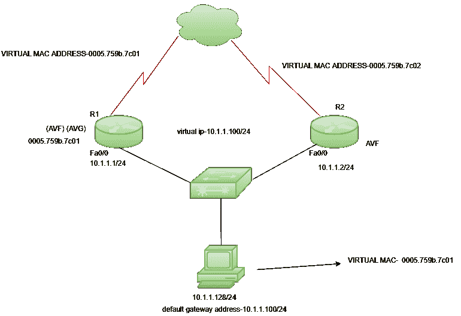

# 网关负载平衡协议(GLBP)

> 原文:[https://www . geesforgeks . org/gateway-负载平衡-协议-glbp/](https://www.geeksforgeeks.org/gateway-load-balancing-protocol-glbp/)

网关负载均衡协议(GLBP)是第一跳冗余协议(FHRP)之一，它和其他第一跳冗余协议一样提供冗余，也提供负载均衡。这是一个思科专有协议，可以执行这两种功能。它使用单个虚拟 IP 地址和多个虚拟 Mac 地址在多台路由器上提供负载平衡。

**GLBP 术语:**

1.  **虚拟 IP 地址**:从配置为所有本地主机默认网关的本地子网中分配一个 IP 地址作为虚拟 IP 地址。
2.  **实际虚拟网关(AVG)** :它是在单个组中运行 GLBP 的路由器之一，负责为组中的每个成员分配虚拟 Mac 地址，并响应来自设备的 ARP 请求。AVG 具有组中最高的优先级值或 IP 地址。
3.  **实际虚拟转发器(AVF)** :这些路由器包括单个 GLBP 组中的 AVG。这些实际上是负责转发数据后，他们被 AVG 分配的任务。如果 AVG 倒下了，其中一个反车辆地雷可以变成 AVG。
4.  **抢占**:这是一种状态，其中 AVF 路由器将成为 AVG 路由器(当 AVG 路由器关闭时)。此外，当 AVG 路由器再次出现时，它将成为 AVG 路由器，因为它的优先级仍然更高(假设)。
5.  **目标跟踪** : GLBP 使用加权方案来确定 GLBP 组中每台路由器的转发能力。GLBP 跟踪接口并调整其权重，即如果被跟踪的接口关闭，它将减少一定的值(根据配置)。

#### GLBP 概念:

实际虚拟网关(AVG)向运行同一组 GLBP 的所有其他路由器提供虚拟 Mac 地址。其余路由器是实际的虚拟转发器(AVF)。当来自子网设备的 ARP 请求想要知道虚拟 IP 地址的 Mac 地址时，其中一个虚拟 Mac 地址由 AVG 提供。AVG 将使用循环算法或其他已应用的算法来提供虚拟 Mac 地址。这样，所有运行 GLBP 的设备都被用来转发流量。

**GLBP 虚拟 Mac 地址分配**:当子网设备(主机)想要发送流量时，它通过发送 ARP 请求来请求虚拟 IP(网关)的 Mac 地址。作为对 ARP 请求的响应，AVG 将提供一个虚拟 Mac 地址(由 AVG 提供给 AVF)。

**虚拟网关冗余**:为了检测网关故障，GLBP 成员通过 *hello* 消息相互通信，每 3 秒钟向组播地址 224.0.0.102 发送一次。如果 AVG 失败，那么具有最高优先级的 AVF 将成为 AVG，即负责提供自动增值服务的媒体访问控制地址。

**虚拟转发器冗余**:就像在 [HSRP](https://www.geeksforgeeks.org/computer-networks-hot-standby-router-protocol-hsrp/) 一样，如果 AVF 的一个出现故障，那么同一个 GLBP 组中的另一个 AVF 将负责转发数据包。一个 GLBP 组最多可以有 4 台路由器。

#### GLBP 负载平衡:

GLBP 使用 3 种算法进行负载平衡–

1.  **循环调度** : AVG 将串行分配虚拟 Mac 地址，就像首先将虚拟 Mac 地址分配给 AVF1，然后再分配给 AVF2 等。
2.  **依赖于主机**:如果特定主机每次都需要特定的虚拟 Mac 地址，那么 AVG 会将特定的 AVF 分配给主机。
3.  **加权**:负载会根据需求进行分配，即按比例分配虚拟 Mac 地址。如果我们想要一些 AVF 处理比其他更多的流量，那么改变权重。

**配置:**
在给定的拓扑中，有两台名为 R1 和 R2 的路由器，其中 R1 通过 fa0/0 连接，ip 地址为 10.1.1.1/24，R2 通过 fa0/0 连接，ip 地址为 10.1.1.2/24。


为路由器 R1 分配 IP 地址。

```
r1(config)# int fa0/0
r1(config-if)# ip add 10.1.1.1 255.255.255.0
```

为路由器 R2 分配 IP 地址。

```
r2(config)# int fa0/0
r2(config-if)# ip address 10.1.1.2 255.255.255.0
```

现在，配置虚拟 IP、GLBP 优先级、抢占和负载平衡类型。

```
r1(config-if)# glbp 1 ip 10.1.1.100
r1(config-if)# glbp 1 priority 120
r1(config-if)# glbp 1 preempt
r1(config-if)# glbp 1 load-balancing round-robin
```

这里，从本地子网和优先级将虚拟 IP 分配为 10.1.1.100(为 R1 分配更高的优先级，因为我们希望此路由器成为 AVG)。此外，抢占已启用，负载平衡类型为循环。现在，为 r2 配置相同的 GLBP。

```
r2(config-if)# glbp 1 ip 10.1.1.100
r2(config-if)# glbp 1 priority 100
r2(config-if)# glbp 1 preempt
r2(config-if)# glbp 1 load-balancing round-robin
```

**注意:**这里，交换机位于 AVG 和 AVF 之间，那么当 AVG 关闭时，交换机将如何获知另一个端口上的相同 Mac 地址？当 AVG 倒下时，新当选的 AVG 将产生一个免费的 ARP 来刷新交换机的 CAM 表和主机 ARP 缓存。

**优势:**

1.  GLBP 支持明文和 MD5 密码认证。
2.  它最多支持 1024 台虚拟路由器(GLBP 组)。
3.  允许使用单个虚拟 IP 和多个虚拟 Mac 地址进行负载共享。