# 在 IAAS 的微软 Azure 上托管网络应用

> 原文:[https://www . geesforgeks . org/hosting-a-web-application-on-Microsoft-azure-in-iaas/](https://www.geeksforgeeks.org/hosting-a-web-application-on-microsoft-azure-in-iaas/)

Azure 提供了许多服务来托管 web 应用程序，无论它是静态的还是动态的。在本文中，我们将通过在虚拟机上使用一个名为 Apache HTTP 服务器的免费开源跨平台网络服务器软件，在微软 Azure 上托管一个简单的静态网络应用程序。静态 web 应用程序可以是简单的 HTML、CSS 或 JavaScript 网站，不需要任何动态更改，尤其是任何服务器端的更改。首先，我们需要一个网络服务器，它将在互联网上托管我们的网络应用程序。为此，我们将部署一个暴露在互联网上的虚拟机(具有公共 IP 地址)以及暴露在外的端口 22 (SSH)和 80 (HTTP)。我们将通过在虚拟机上安装和使用 Apache HTTP 服务器应用程序及其服务，使该虚拟机成为一个正在运行的网络服务器。在 web 服务器成功部署和配置之后，我们将在服务器上部署静态 web 应用程序，该服务器将在互联网上托管该应用程序。

**先决条件**

*   一个 [Azure 订阅](https://docs.microsoft.com/en-us/azure/guides/developer/azure-developer-guide#understanding-accounts-subscriptions-and-billing):如果你没有，在开始之前创建一个[免费账号](https://azure.microsoft.com/free/?ref=microsoft.com&utm_source=microsoft.com&utm_medium=docs&utm_campaign=visualstudio)。
*   静态网络应用程序源。如果你没有或者不想开发，可以利用这个[样例 web app 项目](https://github.com/CODESofRishi/HAA-WebApp2)。
*   用于 SSH 认证的 PuTTy 软件。从[这里](https://www.putty.org/)下载软件。

现在在登录 后，按照下面的文章，成功实现上述声明:

### 创建资源组

> 资源组是 Azure 中的一个组，它将包含作为单个组或单个 Azure 解决方案进行管理的所有资源。最佳做法是在共享相同生命周期的同一资源组中添加资源。

*   在左侧面板上选择*资源组*。

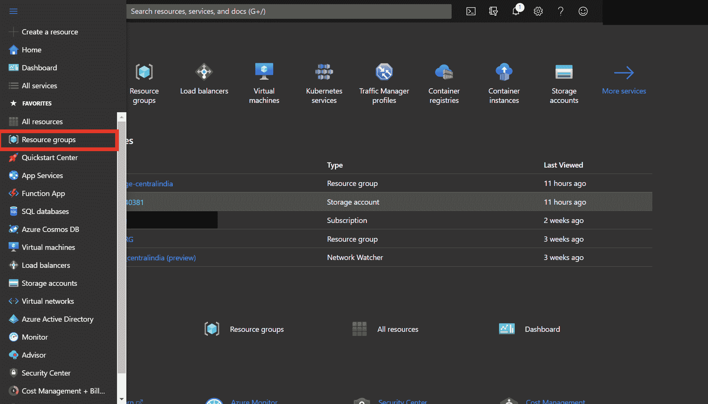

选择左侧面板上的“资源组”。

*   点击*添加。*

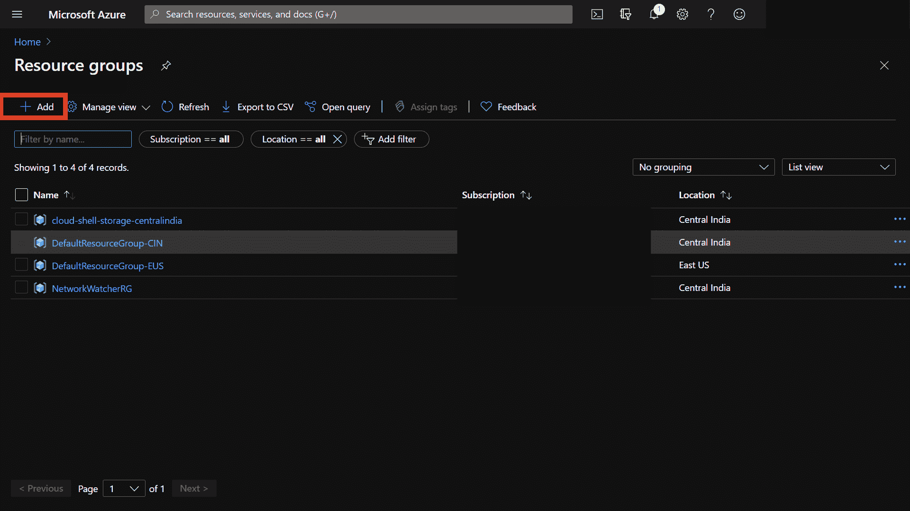

添加/创建新的资源组。

*   选择您的套餐。
*   为您的资源组命名。
*   提供一个区域。
    *   所选区域将存储该资源组内部署的资源的所有元数据。

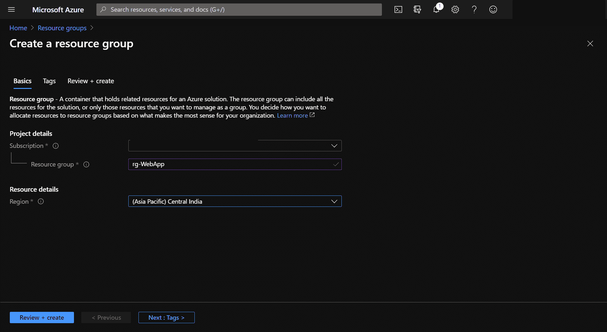

填写资源组所需的基本详细信息。

*   您可以通过向资源组提供标签来为其添加标签，如*名称*和*值*。
*   它可以是任何东西。
*   它是可选的。

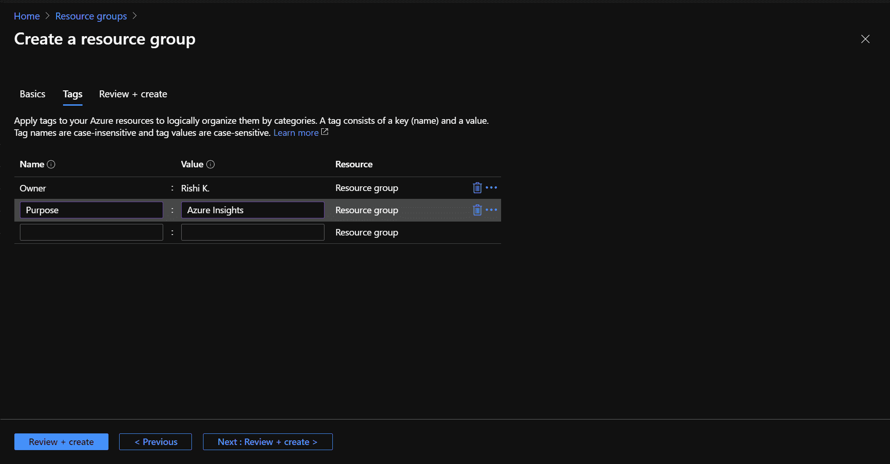

给资源组添加标签(可选)。

*   最后，转到*查看+创建*选项。
*   Azure 将验证您为创建资源组提供的所有详细信息。
*   如果验证通过，可以通过选择*创建*来创建资源组。

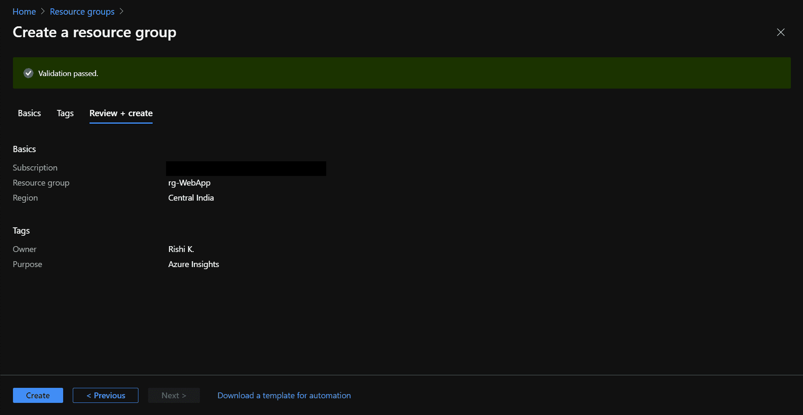

查看并创建您的资源组。

### 创建虚拟机

*   在左侧面板上选择*虚拟机*。

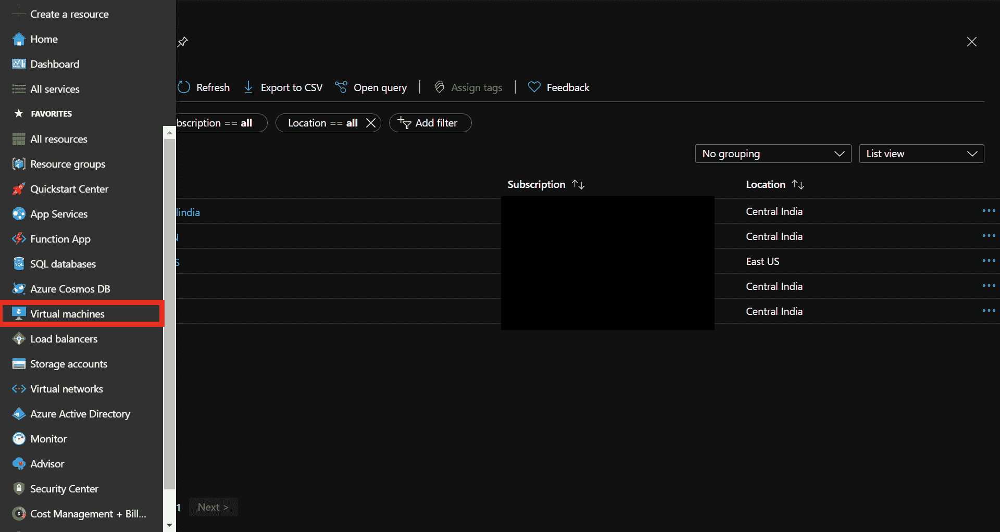

选择左侧面板上的“虚拟机”。

*   选择*添加* ⇢ *虚拟机*。

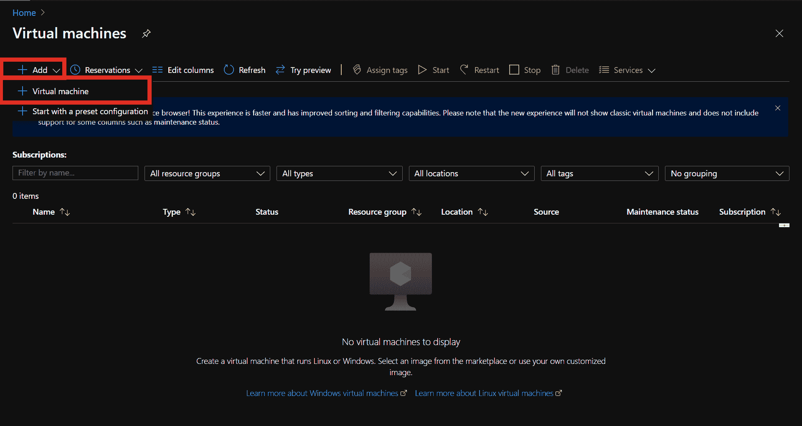

添加/创建新虚拟机。

### **配置虚拟机的基础知识**

1.  提供虚拟机将驻留的资源组的名称或创建一个新的资源组。
    *   在这里，我们将提供一个名为 *rg-WebApp* 的现有资源组，它是我们之前创建的。
2.  为您的虚拟机命名。
    *   这里，我们提供了名称 *MyUbuntu-VM* ，因为我们将使用一个 Ubuntu VM。
    *   如果您不想使用 Ubuntu 虚拟机，您可以通过选择*映像*选项中的*浏览所有公共和私有映像*来为虚拟机指定您自己的映像(转到第 5 点)。
    *   **注意:**这里，在这个实验项目中，由于我们将使用 SSH 身份验证来连接到 VM，因此需要一个 Linux 虚拟机。
    *   如果选择 Windows 映像，您将需要 RDP 身份验证。
3.  提供您希望虚拟机部署到的区域。
    *   这里，我们提供*印度中部*。
    *   提供一个离你更近的区域是一个很好的做法，可以减少延迟。
4.  将*可用性选项*保留为*目前不需要基础设施冗余*。
5.  提供要使用的虚拟机的映像。
    *   这里，我们提供 *Ubuntu 服务器 18.04 LTS–第 1 代*。
6.  通过选择 *CPU* 、 *RAM* 、*数据盘*、 *IOPS* 等不同的值，可以为虚拟机选择不同的大小。，并将相应收费。
7.  选择 SSH 公钥作为身份验证类型。
8.  提供虚拟机的管理员用户名。
9.  在 SSH 公钥源字段中，从下拉菜单中选择使用现有公钥选项。
10.  使用 PuTTygen 软件生成一个公私 SSH 密钥对(非对称加密)。
    *   如果你想知道[如何使用 PuTTygen 生成按键。](https://www.ssh.com/ssh/putty/windows/puttygen)
11.  将生成的公钥粘贴到 SSH 公钥字段中，并将私钥保存在本地机器上。
    *   我们将私钥保存为 PK-1.ppk。
12.  通过启用“允许选定端口”选项，您可以选择并允许某些端口在互联网上公开。
13.  我们允许端口 22(用于 SSH 认证)和端口 80(用于在 HTTP 上访问我们的 web 应用程序)。

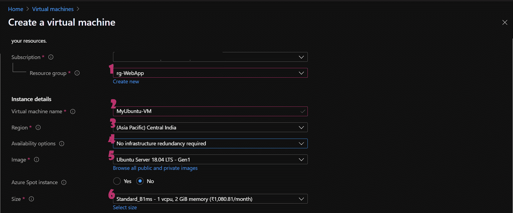

填写虚拟机所需的基本详细信息。(1)

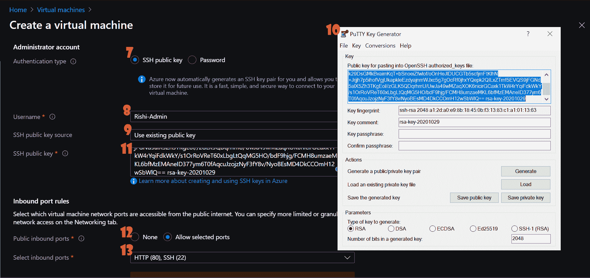

填写虚拟机所需的基本详细信息。(2)

### **配置虚拟机的磁盘**

1.  因为我们不需要使用更高的 IOPS 工作负载，所以从*操作系统磁盘类型* **的下拉菜单中选择*标准硬盘*。**
2.  保留默认加密类型。
    *   在这种情况下，磁盘的加密将由微软管理。
3.  因为我们不会执行任何数据密集型工作负载，所以将*启用超磁盘兼容性*保留为*否*。
4.  如果您想向虚拟机添加额外的磁盘，您可以通过选择*数据磁盘中的*创建并附加新磁盘*选项来实现。*我们不需要任何额外的磁盘，所以留空。

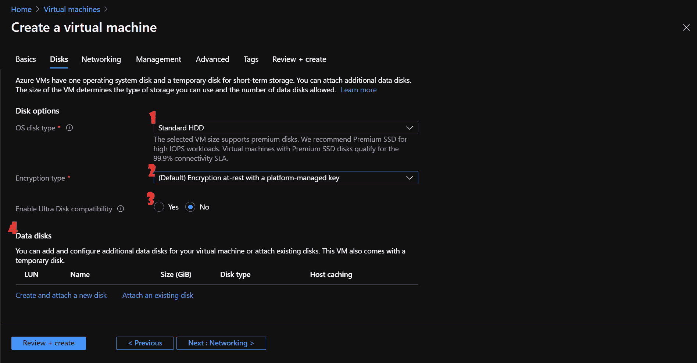

填写虚拟机所需磁盘的详细信息。

### **配置虚拟机的联网**

> 虚拟机需要一个可以驻留、运行和通信的网络。
> 
> 您可以为此目的提供一个 Azure 虚拟网络，它将是您的网络在云中的虚拟隔离表示。

1.  点击*创建*一个*新*选项，创建一个新的虚拟网络。
2.  给你的虚拟网络命名。
3.  为虚拟网络提供地址空间。
    *   这里我们提供的地址空间为 *192.168.0.0/16* 。
4.  在虚拟网络中提供子网。
    *   我们提供了两个名为*子网-1* 和*子网-2* 的子网，地址范围分别为 *192.168.10.0/24* 和 *192.168.50.0/24* 。
5.  您可以决定虚拟机将驻留在哪个子网。
    *   我们选择子网 1。
6.  您可以决定是否为虚拟机提供公共 IP 地址。
    *   由于我们将在 HTTP 上访问我们的网络应用程序，我们给虚拟机一个默认名称的公共 IP 地址。
7.  保持网卡 NSG 为基本。
8.  我们需要允许某些港口开放。
9.  我们选择端口号 80 (HTTP)和 22 (SSH)来打开。
10.  关闭加速网络。
    *   在我们的案例中，虚拟机大小不支持此选项。
11.  目前，我们没有负载平衡器，也没有实施负载平衡器，所以暂时将其保留为否

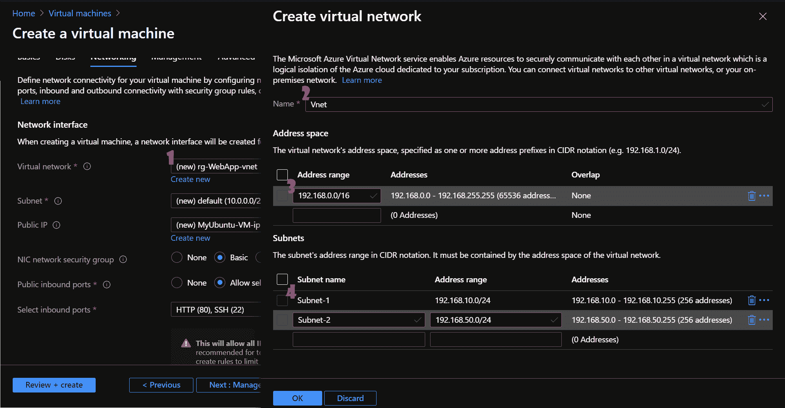

配置虚拟机所需的网络详细信息。(1)

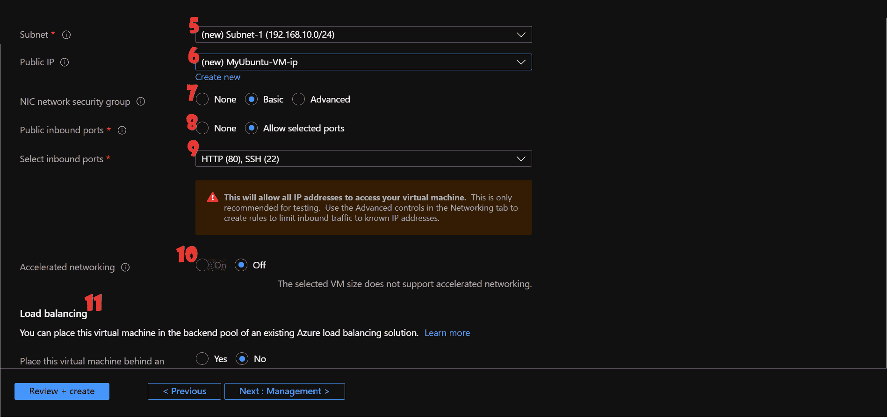

配置虚拟机所需的网络详细信息。(2)

### **配置虚拟机的管理**

1.  *引导诊断*对映像引导故障进行故障排除。通过选择*用*启用一个*管理存储帐户*来启用它。
2.  *操作系统来宾诊断*将每分钟生成监控指标。我们现在不需要它。
3.  保持*身份*选项*关闭*。
4.  *Azure 活动目录*是微软 Azure 提供的目录服务，用于管理对网络和资源的访问和权限。关闭此选项*。*
5.  如果不希望虚拟机在特定日期和时间自动关闭，请关闭自动关闭选项。
6.  关闭备份选项。

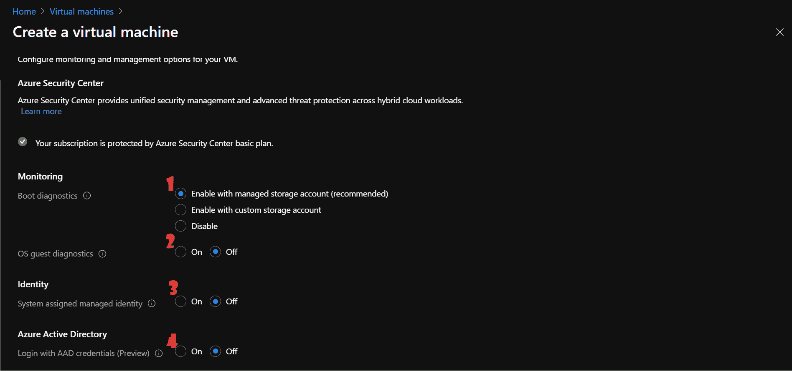

配置虚拟机所需的监控和管理详细信息。(1)


配置虚拟机所需的监控和管理详细信息。(2)

*   如果你愿意，你也可以给你的虚拟机添加标签。
*   最后，转到*查看+创建*选项。
*   如果验证通过，选择*创建*选项，您的虚拟机将在几分钟或几秒钟后部署。
*   选择*转到资源*选项。

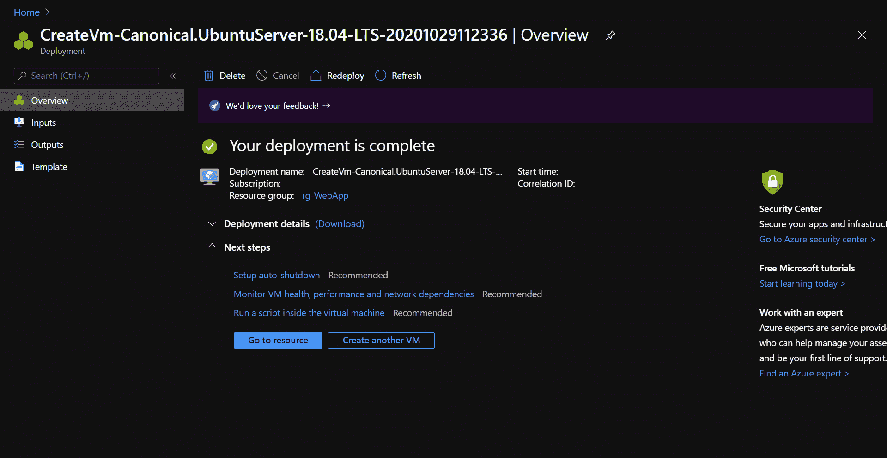

虚拟机部署概述。

### 向虚拟机进行身份验证

*   在资源的*概述*部分，您可以看到私有 IP 地址是 *192.168.10.4* ，它确认虚拟机驻留在我们指定的第一个子网中。
*   复制虚拟机的*公共 IP 地址*。

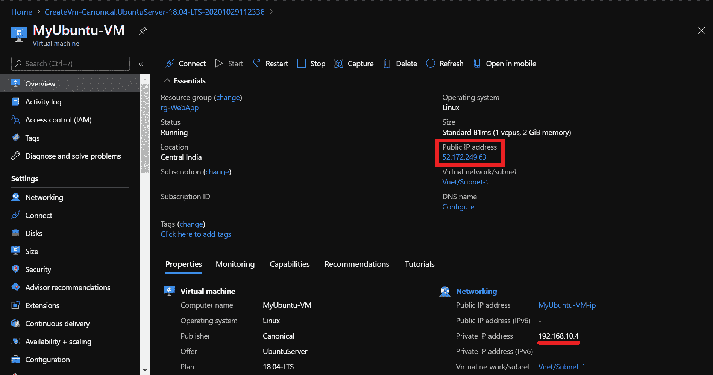

从概述部分复制虚拟机的公共 IP 地址。

*   打开 PuTTy 软件。
*   将虚拟机的公共 IP 地址粘贴到*主机名(或 IP 地址)*字段，并指定用于 SSH 身份验证的端口号 22。
*   转到 PuTTy 左侧面板中的 SSH ⇢身份验证选项。

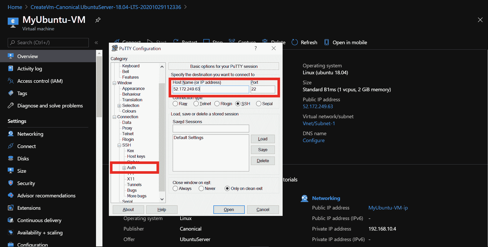

将虚拟机的公共 IP 地址粘贴到 PuTTy 中。

*   浏览并在*认证*字段的*私钥文件*中指定我们保存为 *PK-1.ppk、*的私钥。
*   点击*打开*。

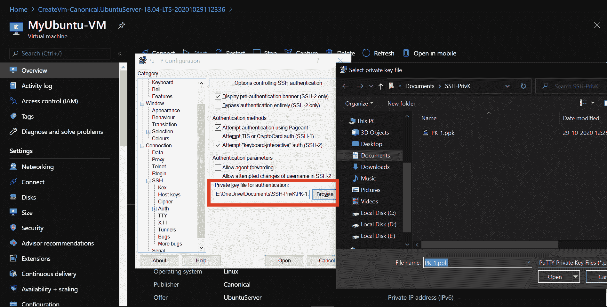

在 PuTTy 中提供私钥。

*   PuTTy 将为您提供虚拟机的命令行界面
*   如果您收到*油灰安全警报*，请在选项中单击*是*。
*   提供管理员用户名并按回车键。
*   您将登录到虚拟机。

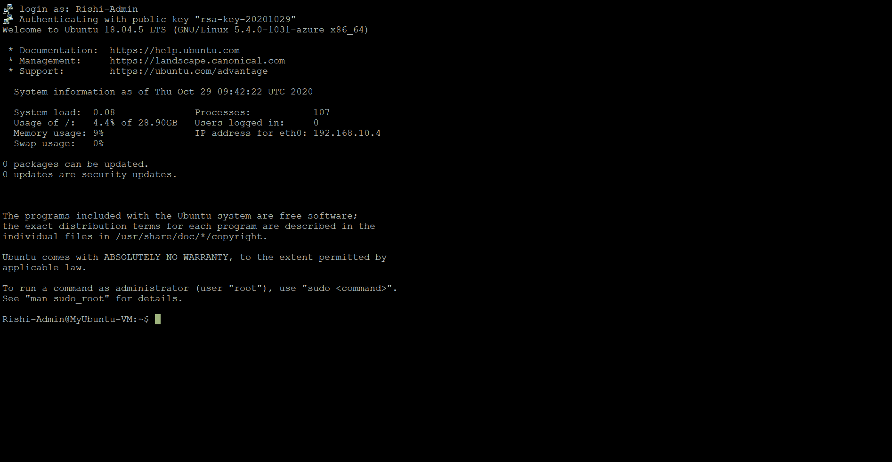

虚拟机身份验证成功。

### 托管静态网络应用程序

**1。**使用命令安装 Apache HTTP 服务器，

```
sudo apt-get install apache2
```

**2。**使用命令运行 Apache 服务，

```
sudo service apache2 start
```

**3。**复制虚拟机的公共 IP 地址，并在互联网上浏览，指定端口号 80，如下所示。

```
<VM's public IP address>:80
```

*   您必须能够看到 web 服务器正在运行，并且默认网页托管在互联网上。
*   如果您愿意，您可以对驻留在路径 */var/www/html/index.html* 中的该网页进行更改，并重新加载该网页以查看更改。

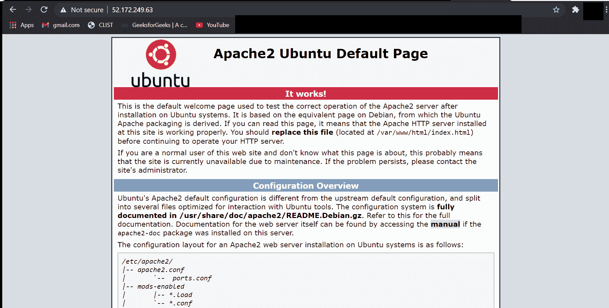

web 服务器正在运行&默认网页已成功托管。

**4。**现在使用命令*、*导航至路径

```
*cd /var/www/*
```

***5。**使用命令删除目录 *html* ，*

```
*sudo rm -rf html*
```

***6。**使用命令从 GitHub 或任何其他版本控制(如果有)克隆您的 web 应用程序源，*

```
*sudo git clone https://github.com/CODESofRishi/HAA-WebApp2.git*
```

***7。**使用命令将从 GitHub 克隆的目录重命名为 *html* ，*

```
*sudo mv HAA-WebApp2/ html*
```

***8。**重新加载网页。*

*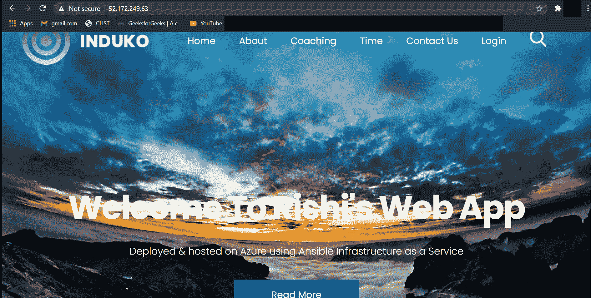

我们的静态 web 应用程序已成功托管。* 

*恭喜您，您的静态 web 应用程序现已托管在互联网上。*

### *在结束之前*

*   *只要虚拟机还在运行，就会向您收取费用。*
*   *因此，完成项目后，不要忘记删除资源组。*
*   *在 Azure 门户的左侧面板，转到*资源组*。*
*   *选择您的资源组。*
*   *选择*删除资源组*选项。*

*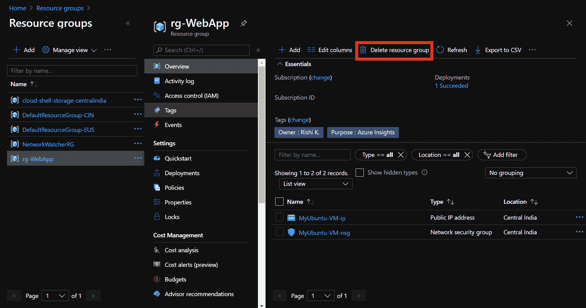

删除资源组。*