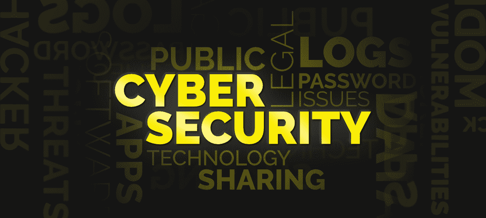

# 安全系统应如何发展以应对网络安全威胁和漏洞？

> 原文:[https://www . geesforgeks . org/how-security-system-应该如何演变-处理-网络安全-威胁和漏洞/](https://www.geeksforgeeks.org/how-security-system-should-evolve-to-handle-cyber-security-threats-and-vulnerabilities/)

组织因网络安全威胁和漏洞而瘫痪的故事正处于顶峰。根据赛门铁克公司发布的一份报告，印度是成为网络犯罪受害者的前五个国家之一。如今，云计算、物联网、认知计算等现代技术。被归类为任何组织的关键资产。随着先进技术和互联应用的使用增加，不仅企业，而且威胁和漏洞也在迅速增加。

在本专题中，我们将重点关注安全威胁、维权者在保护组织免受新威胁方面面临的挑战，以及安全系统应如何发展以应对日常关键安全挑战。让我们深入挖掘以下主题。

*   **网络威胁**
*   **安全挑战**
*   **安全系统必须如何进化？**

## 网络威胁

技术正在发生前所未有的变革。随着技术的进步，组织开始以更快的速度实现持续的业务增长。他们能够以一种智能的方式将人、机器人、小工具、内容等相互连接起来，从而推动更多的业务。但是，与此同时，技术的进步为网络犯罪、有针对性的攻击和企业间谍活动打开了一个关注中心。

网络威胁是一种恶意攻击，它获得对系统或网络的未授权访问，从而破坏或窃取机密数据。让我们进一步了解不同类型的网络威胁。

1.  易货
2.  **DDoS 攻击**
3.  **威胁源自组织内部**
4.  **数据泄露**
5.  **高级持续威胁(APT)**

### 1.勒索软件

Ransomware 是一种恶意软件，它对系统数据进行加密，并要求支付访问许可费。它阻止你进入系统，如果不按时付款，还会破坏数据。根据 Sophos 进行的一项调查，在 2019 年，超过 51%的组织受到了勒索软件的攻击。在黑暗的网络市场上，软件也可以作为软件即服务(RaaS)使用。WannaCry、NotPetya、SimpleLocker、TeslaCrypt、CryptoLocker 和 PC Cyborg 都是一些 Ransomware。

### 2.分布式拒绝服务(DDoS)攻击

[DDoS 攻击](https://www.geeksforgeeks.org/denial-of-service-ddos-attack/)是一种恶意攻击，通过压倒性的随机流量增加服务器的流量。在 DDoS 中，服务器是在僵尸网络的帮助下从不同的独立网络中定位的，这就是它与 DoS 的区别。其中一个著名且报道最多的影响是针对美国域名服务提供商 Dyn 的。针对 Dyn 的 DDoS 攻击已经影响了许多网站，包括推特、GitHub、亚马逊、网飞等。

### 3.威胁源自组织内部

内部威胁是来自组织内有权访问机密信息的人员的恶意威胁。可以是员工、前员工、合作伙伴、同事等等。利用这些威胁，攻击者可以以合法的方式绕过安全。

### 4.数据泄露

数据泄露可以定义为机密信息的泄露，包括敏感的公司文档、技术蓝图、商业机密等。会导致财务损失、品牌声誉损失、客户信任损失等等。数据泄露的一些主要原因是恶意攻击、安全系统薄弱和人为错误。根据威瑞森数据泄露报告，超过 88%的数据泄露涉及人为错误。

### 5.高级持续威胁(APT)

APT 是一种高级攻击威胁。它使用多个阶段来破坏网络，从而允许未经授权的人员留在组织网络中。APT 可能通过鱼叉式网络钓鱼或内部威胁发生。这种威胁很难检测到，并且可以在一段持续的时间内检索到有价值的信息。

## 安全挑战

领先于你的对手；如果你不这样做，很快你就会成为受害者。让我们讨论一些安全挑战。

### 1.缓慢的安全适应

与网络安全系统相关的问题之一是，网络安全解决方案没有以预期的速度发展。在当今的数字时代，云技术和其他解决方案正在以更快的速度发展，传统的网络架构已经被简单而扁平的架构所取代。但是，关于网络安全解决方案，许多组织仍然使用传统的基于区域的安全解决方案来防止威胁。

### 2.人为错误

人为错误，如系统配置错误、补丁管理不足等。在大多数组织中都很常见。这些错误导致了许多网络攻击。根据 IBM 的安全威胁，超过 95%的网络攻击是由人为错误造成的。

### 3.第三方供应商安全风险

在当今世界，一切都是相互联系的。组织让第三方存储他们的信息，以实现更好的业务运营。但是，如果他们不选择值得信赖的第三方供应商，那么组织就有风险。在这里，攻击者可以通过发起供应链攻击来绕过安全系统。

## 安全系统必须如何发展？

在本节中，我们将讨论防御威胁和加强网络安全系统的高级安全策略。让我们花点时间来了解一些最佳安全实践。它们如下:

*   **威胁预防策略**
*   **零信任方法**
*   **假设违约进场**

### 1.威胁预防策略

安全研究人员正在研究和创新有效的解决方案来防止威胁。他们夜以继日地针对零日漏洞开展工作，并积极参与实施意识计划。威胁预防策略主要分为四个主要部分。它们如下:

*   **减少攻击面**:漏洞扫描实践的持续过程有助于确定顶级风险应用、网络中的安全漏洞、有风险的用户和流程等。相对攻击面商(RASQ)就是这样一种方法，它可以跟踪攻击面的每一个变化。
*   **完全可见**:端点保护是另一个需要考虑的因素。在大多数情况下，使用基于中小型企业的漏洞会危及终端安全。因此，将正常的中小企业行为与奇怪的中小企业行为分开很重要，这种分类可以通过提供完整的可见性来完成。它是识别恶意行为的关键。
*   **防范已知威胁**:防范已知威胁需要防火墙和杀毒软件。这是防御网络和端点的第一步。
*   **防范未知威胁**:高级和未知威胁正以前所未有的速度发展。因此，实现 100%的威胁防护更具挑战性。为了应对这种威胁，组织必须采用新技术，如动态和行为分析、深度学习技术以及攻击者技术、策略和程序(TTPs)分析。

### 2.零信任方法

零信任方法策略是持续验证所有数据和资产。它有助于发现通过横向移动泄露敏感信息的攻击者。让我们花一点时间来了解零信任方法的过程。

*   **敏感数据识别分类**:数据保护需要对敏感数据进行识别分类。
*   **映射数据流**:你必须通过与网络团队、应用团队和安全架构师的协作，了解整个网络的应用流程。
*   **架构网络**:通过识别物理和虚拟配置来架构网络。它包括多个网络之间的通信流和外部数据访问过程。
*   **创建策略库**:在创建策略库的同时，应该包含高效的访问控制机制、关于用户身份、应用行为等信息。
*   **持续监控**:在这个过程中，对内部和外部流量都进行持续监控。在这里，网络和应用程序日志经常被实时检查。

### 3.假设违约方法

现实情况是，没有任何安全防范技术可以确保您 100%抵御威胁。随着时间的推移，高级威胁设法绕过了安全系统。这就是假设违约方法的重要性。这是测试组织的事件响应能力的一种方式。它提供各种安全解决方案和服务。它们如下:

*   **红队演习**:是渗透测试的高级版本，由高度专业的安全专家组成的团队不仅可以发现漏洞，还可以测试组织的威胁检测和响应能力。它开辟了一条立即和长期改善安全态势的途径。
*   **持续监控**:持续监控是早期检测威胁所必需的，可以通过提供用户以及网络端点的实时可见性来实现。主动安全监控系统可以通过主动监控网络、应用程序和用户活动来确保网络卫生和合规性。用于监控的一些常用工具是安全信息和事件管理(SIEM)工具以及端点检测和响应(EDR)工具。

## 摘要

攻击者不断寻找漏洞，以获得对应用程序或网络的未授权访问。随着技术的进步，安全威胁和模型正在以更快的速度发展。这些安全威胁和模型可以隐藏起来，自毁，绕过传统的安全系统，等等。因此，它可能会对您的机密信息造成损害、公司窃听等。因此，有必要定制一个漏洞管理系统，防御威胁并加强网络安全系统。