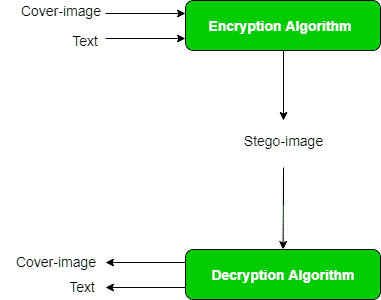

# 密码学中的图像隐写术

> 原文:[https://www . geeksforgeeks . org/image-密码学中的隐写术/](https://www.geeksforgeeks.org/image-steganography-in-cryptography/)

单词**隐写术**来源于两个希腊单词——“stegos”意为“覆盖”和“grayfia”，意为“写作”，因此翻译为“覆盖写作”，或“隐藏写作”。**隐写术**是一种隐藏秘密数据的方法，通过将其嵌入到音频、视频、图像或文本文件中。它是用来保护机密或敏感数据免受恶意攻击的方法之一。

**与密码学有何不同？**
密码学和隐写术都是用来隐藏或保护秘密数据的方法。然而，它们的不同之处在于密码学使数据不可读，或者隐藏数据的*含义*，而隐写术隐藏数据的*存在*。

通俗地说，密码学类似于用秘密语言写一封信:人们可以阅读它，但不会理解它的含义。然而，一个(可能是秘密的)信息的存在对任何看到这封信的人来说都是显而易见的，如果有人知道或理解了你的秘密语言，那么你的信息就很容易被阅读。

如果你在同样的情况下使用*隐写术*，你会把这封信藏在一双袜子里，你会把它送给这封信的预定收件人。对于那些不知道这个消息的人来说，看起来你的礼物除了袜子没有别的了。但是预期的接收者知道要寻找什么，并且发现消息隐藏在他们之中。

类似地，如果两个用户在互联网上交换媒体文件，那么要确定这些文件是否包含隐藏的消息将比使用加密技术进行通信更加困难。

密码学通常用于补充隐写术提供的安全性。加密算法用于在将秘密数据嵌入封面文件之前对其进行加密。

**图像隐写术–**
顾名思义，图像隐写术是指在图像文件中隐藏数据的过程。为此选择的图像称为**封面图像**，隐写后得到的图像称为**隐写图像**。

**是怎么做到的？**
图像在内存中表示为 N*M(对于灰度图像)或 N*M*3(对于彩色图像)矩阵，每个条目代表一个像素的强度值。在图像隐写术中，通过改变由加密算法选择的一些像素的值，将消息嵌入到图像中。图像的接收者必须知道相同的算法，以便知道他或她必须选择哪些像素来提取消息。

**图–**图像隐写过程

通过**隐写分析**过程来检测**封面图像**内的消息。这可以通过与封面图像比较、直方图绘制或噪声检测来完成。在努力开发对这种攻击具有更高免疫力的新算法的同时，也在努力改进现有的隐写分析算法，以检测恐怖分子或犯罪分子之间的秘密信息交换。