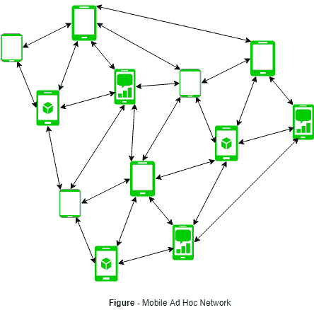

# 移动自组织网络(MANET)简介

> 原文:[https://www . geeksforgeeks . org/移动自组织网络简介/MANET/](https://www.geeksforgeeks.org/introduction-of-mobile-ad-hoc-network-manet/)

MANET 代表移动自组织网络，也称为无线自组织网络或自组织无线网络，通常在链路层自组织网络之上具有可路由的网络环境..它们由一组移动节点组成，这些节点在自配置、自修复的网络中无线连接，无需固定的基础设施。随着网络拓扑结构的频繁变化，移动自组网节点可以自由地随机移动。每个节点都像路由器一样将流量转发到网络中的其他指定节点。

移动自组网可以独立运行，也可以成为更大的互联网的一部分。它们形成高度动态的自治拓扑，节点之间存在一个或多个不同的收发器。移动自组网面临的主要挑战是装备每台设备，以持续维护正确路由流量所需的信息。移动自组网由一个对等的、自形成的、自修复的网络组成。大约在 2000-2015 年，移动自组网通常以射频(30MHz-5GHz)进行通信。这可以用于道路安全，从环境、家庭、健康、灾难救援行动、空中/陆地/海军防御、武器、机器人等传感器。

**移动自组网的特点–**

*   **动态拓扑:**
    典型的多跳网络拓扑可能会随着时间随机快速变化，它可以形成单向或双向链路。
*   **带宽受限、容量可变的链路:**
    与有线网络相比，无线链路通常具有较低的可靠性、效率、稳定性和容量
*   **自主行为:**
    每个节点都可以充当主机和路由器，可见其自主行为。
*   **能量受限运行:**
    由于部分或全部节点依靠电池或其他可耗尽的方式获取能量。移动节点的特点是内存少、功耗低、重量轻。
*   **有限安全:**
    无线网络更容易受到安全威胁。由于安全、路由和主机配置操作的分布式特性，没有集中式防火墙。
*   **较少人为干预:**
    它们需要最少的人为干预来配置网络，因此它们本质上是动态自治的。

**移动自组网的优缺点–**

**优点:**

1.  与中央网络管理分离。
2.  每个节点都可以扮演两个角色。路由器和主机表现出自主性。
3.  自我配置和自我修复节点不需要人工干预。

cons:t1]

1.  由于噪声、干扰条件等各种限制，资源是有限的。
2.  缺乏授权设施。
3.  由于物理安全性有限，更容易受到攻击。