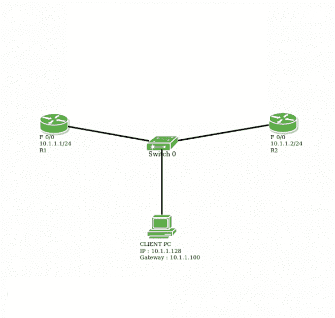

# 虚拟路由器冗余协议(VRRP)及其配置介绍

> 原文:[https://www . geesforgeks . org/虚拟路由器简介-冗余-协议-vrrp-及其配置/](https://www.geeksforgeeks.org/introduction-of-virtual-router-redundancy-protocol-vrrp-and-its-configuration/)

VRRP 协议是一种开放标准协议，用于在网络中提供冗余。它是一种网络层协议(协议号-112)。

组中的路由器(组成员)数量充当虚拟逻辑路由器，它将是所有本地主机的默认网关。如果一台路由器发生故障，另一个组成员可以负责转发流量。

**一些与 VRRP 相关的重要术语:**

1.  **虚拟 IP 地址:**从本地子网分配一个 IP 地址作为虚拟 IP 地址，该子网被配置为所有本地主机的默认网关。
2.  **虚拟 MAC 地址:**将最后 8 个字节作为十六进制的 VRRP 组号，自动生成一个虚拟 MAC 地址。在 VRRP，使用的 Mac 地址是 0000.5e00.01xx。这里，xx 是十六进制的 VRRP 组号。
3.  **主路由器:**其中一个 VRRP 组成员被选为主路由器，负责转发本地流量。路由器是根据优先级选择的。如果 VRRP 组的某个成员比其他成员具有更高的优先级，那么它将被选为主路由器。如果优先级相同(默认为 100)，则具有最高 IP 地址的路由器将成为主路由器。
4.  **备份路由器:**只有一个 VRRP 组成员将成为主路由器，而其他成员将成为备份路由器。如果主路由器出现故障，那么备用路由器之一将成为主路由器。
5.  **主通告定时器:**主路由器每 1 秒以 224.0.0.18 组播保活报文。
6.  **主死定时器:**如果没有收到主通告消息，备份路由器将承担主路由器职责的时间。默认情况下是 3.69 秒。
7.  **Prempt :** 是备份路由器中的一个成为主路由器的状态(当主路由器停机时)。此外，当主路由器再次出现时，它将成为主路由器，因为它的优先级仍然更高。
8.  **目标跟踪:**VRRP 目标跟踪提供了一种最佳路由器成为主路由器的方式。当前主路由器持续轮询被跟踪对象的状态(例如线路协议是开启还是关闭)。假设如果主路由器线路协议关闭，那么备用路由器的优先级将动态增加，即它将成为主路由器。
9.  **认证:**
    VRRP 支持 3 种认证–
    1。无认证
    2。纯文本认证
    3。MD5 身份验证

> 在以下任何情况下，VRRP 都会拒绝数据包:
> 
> 1.路由器和传入数据包的身份验证方案不同。
> 2。MD5 摘要因路由器和传入数据包而异。
> 3。文本身份验证字符串在路由器和传入数据包上是不同的。

**配置:**

在上面给定的拓扑中，有两台名为 R1 和 R2 的路由器，其中 R1 fa 0/0 ip 地址为 10.1.1.1/24，R2 fa0/0 ip 地址为 10.1.1.2/24。

为路由器 R1 分配 IP 地址:

```
r1# int fa0/0
r1# ip add 10.1.1.1 255.255.255.0
```

为路由器 r2 分配 IP 地址。

```
r2# int fa0/0
r2# ip address 10.1.1.2 255.255.255.0
```

现在，让我们提供虚拟 IP 地址(10.1.1.100)、组名 *VRRP_TEST* 、组号 10 和优先级 110。此外，这里默认情况下已启用抢占，即如果主路由器关闭，备份路由器将自动成为主路由器。

```
r1# int fa0/0
r1# vrrp 10 ip 10.1.1.100
r1# vrrp 10 name VRRP_TEST
r1# vrrp 10 priority 110
```

现在，提供虚拟 IP 地址(10.1.1.100)、组名 VRRP_TEST 和优先级 100。此外，还分配了第 10 组。

```
r2# int fa0/0
r2# vrrp 10 ip 10.1.1.100
r2# vrrp 10 name VRRP_TEST
r2# vrrp 10 priority 100
```

**注意:**由于给 r1 提供了优先级 110，因此，它将成为主路由器。