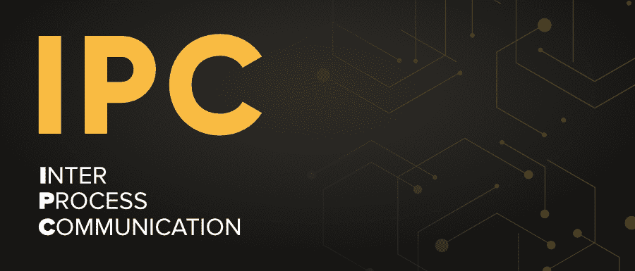

# 仪表板组合仪表完整表格

> 原文:[https://www.geeksforgeeks.org/ipc-full-form/](https://www.geeksforgeeks.org/ipc-full-form/)

**IPC** 代表**进程间通信**。它是过程交流的媒介。这是一种操作系统允许所有独立进程在通过网络连接的单个或多个系统中相互交互或通信的技术。同时，它可以处理许多请求。或者我们也可以说，它用于在一个或多个进程中的多个线程之间共享数据。它们被进程用作抽象设备，但是在操作系统中，它们可以以各种方式实现。

通常，操作系统使用 IPC 来传输大量数据。这种技术会影响性能和能耗。像 DOS 这样的单一进程操作系统不支持它。IPC 同步要同时实现的请求。所以，我们可以说，每一个单独的过程都是在不影响彼此的情况下运行的，它们之间的交流可以被视为它们之间的一种合作方法。

#### 仪表板组合仪表的特点

*   **Synchronus and Asynchronous communication:**
    Each message is queued, sending processes cause messages to be added to remote queues, and receiving processes remove messages from the local queues. This communication between these sending and receiving processes can be synchronous or asynchronous.

    每条消息的发送和接收都是同步的，在这种情况下，发送和接收都是阻塞操作。如果消息是由发送进程发送的，它将一直被阻止，直到接收进程发出接收，当该进程收到消息时，它将被阻止，直到下一个消息到达。

    发送操作的使用是非阻塞的，因为发送过程发送消息，消息的传输与发送过程并行进行，接收操作可以有阻塞和非阻塞两种变体。在发出接收操作后，接收过程立即继续其程序。

*   **消息目的地:**
    消息目的地是计算机内的本地端口，指定为整数。一个端口只能有一个接收器和多个发送器。
*   **Reliability:**
    Reliable communication can be defined in terms of validity and integrity.

    为了有效，点对点消息服务被定义为可靠的，如果消息被安全地传递而没有任何数据包丢失或丢失。

    为了完整性，消息应该没有任何损坏和重复。

*   **排序:**
    某些应用程序的要求是，消息只能按发送者顺序传递，如果消息不按发送者顺序传递，则这些应用程序应将这些消息视为失败。

#### 优势

*   共享信息，因为许多进程都愿意共享同一条信息。
*   任务可以被分成子任务，然后可以在单独的处理器上运行，并且它们可以使用 IPC 来交换信息，这提高了程序的执行效率。
*   维护和调试更容易，因为程序被分成多个代码块，每个代码块分别执行功能。
*   同时，单个用户可以执行多个任务。例如同时用户可以听音乐，可以做编辑，并且并行编译。

#### 不足之处

*   它比直接函数调用慢。
*   因为 IPC 编写操作系统需要编写一些必须考虑的消息传递 API。
*   可能会出现需要解决的同步和内存保护等问题。
*   进程不能写入相同的内存位置。