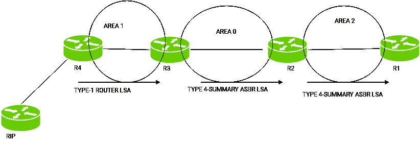

# 链接状态广告(LSA)

> 原文:[https://www.geeksforgeeks.org/link-state-advertisement-lsa/](https://www.geeksforgeeks.org/link-state-advertisement-lsa/)

[开放最短路径优先(OSPF)](https://www.geeksforgeeks.org/computer-network-open-shortest-path-first-ospf-protocol-states/) 是一种[链路状态路由协议](https://www.geeksforgeeks.org/computer-network-classes-routing-protocols/)，用于使用自己的最短路径优先(SPF)算法寻找源路由器和目的路由器之间的最佳路径。OSPF 路由器通过交换 LSA 来更新和维护运行 OSPF 的设备的拓扑 OSPF 数据库，但是要首先了解 LSA 的类型，我们首先必须了解路由器在 OSPF 的角色。

**路由器角色–**

1.  **骨干路由器–**0 区称为骨干区，0 区的路由器称为骨干路由器。

2.  **内部路由器–**内部路由器是指所有接口都在一个区域内的路由器。

3.  **区域边界路由器(ABR)–**连接骨干区域与另一区域的路由器称为区域边界路由器。因此，AbR 维护多个链路状态数据库，描述主干拓扑和其他区域的拓扑。

4.  **自治系统边界路由器(ASBR)–**当 OSPF 路由器连接到不同的协议，如 EIGRP、边界网关协议或任何其他路由协议时，它被称为自治系统。连接两个不同自治系统(其中一个接口在 0 区运行 OSPF)的路由器称为自治系统边界路由器。这些路由器执行重新分发。ASBRs 同时运行 OSPF 和另一种路由协议，如 RIP 或 BGP。

**LSA 类型–**
根据运行 OSPF 的设备所在的区域，交换了不同类型的 LSA。

1.  **Type-1 (Router Link Advertisement) –** This is a Type-1 LSA exchanged by the routers which belongs to a same area. The router contains status of link, Router I’d, IP information and current interface state. If a router is connected to multiple areas then separate Type 1 LSA is exchanged. 

1.  如图所示，类型 1 LSA 由同一区域内的路由器交换，但是如果路由器的其他接口在另一个区域，则不同的类型 1 LSA 将被交换。

2.  **Type-2 (Network Link Advertisement) –** This is a Type-2 LSA which is send by DR (Designed Router) only to all the other routers present in the same area (broadcast or multi-access network) . These contain the DR and BDR IP information and also the state of other routers that are part of same network. Remember DR is responsible for distributing routing information to all other routers present in same broadcast area. 

1.  如图所示，在广播网络中，只有 DR 会将路由信息分发给同一区域的其他路由器。

2.  **Type-3 (Summary LSA) –** This is a Type-3 LSA which are generated by ABRs to areas other than in which it resides. The topological database which ABR receives from other areas are injected into the backbone area. This includes the IP information and Router I’d of ABR that is advertising these LSA. 

1.  如图所示，R3 (ABR)通过生成类型 3 LSA 将区域 1 的路由信息泛洪到其他区域。

2.  **Type-4 (Summary ASBR LSA) –** ABR send these Type 4 LSA towards the area other than the area in which they are generated. These LSAs are generated by ABR to tell others the route to ASBR. 

1.  如图所示，R4 是一个 ASBR，因此为了通告自己通往 R3 的路由，R4 将生成一个类型 1 的 LSA，然后生成一个类型 4 的 LSA，并将 LSA 泛洪到所有其他外部区域，以告知 ASBR 通往其他区域路由器的路由。

2.  **Type-5 AS external link advertisement –** These LSAs are generated by ASBR to advertise routes of other Autonomous System than OSPF. 

1.  如上图所示，R4 将成为 ASBR(作为 OSPF 和 RIP 的连接区域)，路由 1.1.1.0/24 将在 OSPF 地区发布广告。这是 ASBR 向 OSPF 地区通告其他路由协议路由的责任，因此 R4 现在将创建一个 5 类 LSA，向所有其他 OSPF 地区通告这些路由。