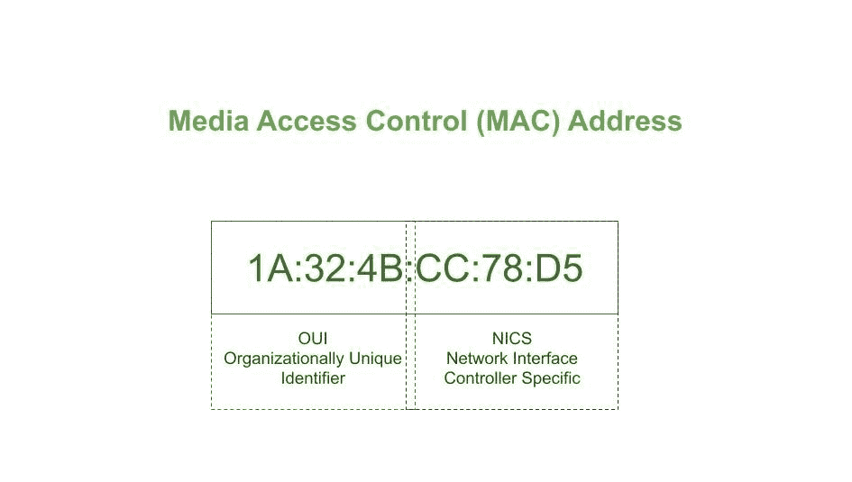

# MAC 完整格式

> 原文:[https://www.geeksforgeeks.org/mac-full-form/](https://www.geeksforgeeks.org/mac-full-form/)

**MAC** 代表**媒体访问控制。**
媒体访问控制地址被定义为硬件的**识别号。一般来说，每台计算机的网络接口卡(网卡)，如无线网卡、蓝牙卡或以太网卡，都有供应商在制造时嵌入的不可更改的媒体访问控制地址。戴尔、北电、贝尔金和思科是一些著名的网卡制造商。可以通过更换网卡来更改设备的默认地址。

**历史****

就历史而言，我们可以说**施乐 PARC 科学家**创造了**媒体访问控制**地址的存在。有许多类似的术语用来代替媒体访问控制地址，如硬件地址、物理地址、网络设备的以太网硬件地址。甚至连老化地址(BIA 尤其是思科路由器交换机)也被称为相同的。

#### 特征

*   被认为是硬件区别号的 MAC 地址是**全球唯一的。**这使我们能够识别连接网络中的每台设备。
*   The total length MAC address in **byte is 6 (or 48 bits)**. According to the IEEE 802 standards, this address is written in three commonly used formats:
    *   六个两位十六进制数字，用连字符(-)分隔，如 45-67-89-AB-12-CD。
    *   六个两位十六进制数字，用冒号(:)分隔，如 45:67:89:AB:DE:23。
    *   四个三位数的十六进制数字，用点(。)比如 ABCD.4567.1238。

    地址空间可能形成的 MAC 地址约为 **2^48** (超过 281 万亿)。

*   地址的右 24 位(4 字节)被称为**组织唯一标识符(OUI)号。**该 OUI 号码由**互联网号码分配机构** (IANA)分配。对于同一家公司生产的网卡，这个全球唯一的 OUI 号码将始终保持不变。地址的左 24 位(4 字节)称为**网络接口控制器专用(NICS)**，负责通过电缆或计算机网络无线通信。
*   第二层上的一些设备是网卡、网桥和交换机。该层还负责局域网传输下物理层上的无差错数据传输。如果参考我们的开放系统互连(OSI)网络模型，我们会发现媒体访问控制协议子层**中的 MAC 地址使用的是数据链路层**。

#### 优势

*   连接到网络的设备没有或**免费连接费用**与之相关联。
*   路由器或交换机上设置了策略。无论连接人员是谁，都允许连接设备或不允许连接设备。
*   同一网络子网中所有设备的媒体访问控制地址都不同。因此，**诊断与 IP 地址等相关的网络问题**。很容易，因为媒体访问控制地址很有用。
*   网络管理员在借助媒体访问控制地址识别网络上数据的发送者和接收者时感到**可靠**。背后的唯一原因是，与动态 IP 地址不同，MAC 地址不会不时发生变化。

#### 不足之处

*   由于 MAC 地址的前三个字节(OUI)是为制造商保留的，因此它仅限于同一制造商的每个 OUI 的 **2^24 唯一地址**。
*   我们可以说**欺骗对于 MAC 地址过滤来说很容易**。由于以太网的广播特性，人们可以伪装起来，只听允许的媒体访问控制地址。
*   在大多数情况下，入侵者可以通过不断将自己的媒体访问控制地址更改为允许的地址来访问网络。