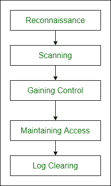

# 黑客遵循的方法

> 原文:[https://www . geeksforgeeks . org/method-黑客遵循/](https://www.geeksforgeeks.org/methodology-followed-by-the-hackers/)

**概述:**
在流行媒体中，术语“[黑客](https://www.geeksforgeeks.org/types-of-hackers/)**是指利用 bug 和漏洞侵入他人安全的人，或者利用自己的技术知识进行生产性或恶意行为的人。黑客是精通硬件和软件的计算机专家。黑客是精通编程语言以及安全和网络管理的计算机爱好者。他是那种喜欢学习新技术和复杂的计算机系统来提高自己的能力和才能的人。**

****

****不同类型的方法论:**
在这里，我们将讨论不同类型的方法论如下。**

1.  ****侦察–**
    侦察是收集目标系统信息的过程。寻找计算机系统中的漏洞，或者留下漏洞的方法是这个过程的一部分。如果黑客能够进入系统，他或她将继续黑客程序。黑客在侦察阶段结束时有很多知识，他可以利用这些知识对目标系统进行有希望的攻击。** 
2.  ****扫描–**
    在发起攻击之前，黑客想要确定系统是否可以运行，哪些应用程序正在使用，以及这些程序的哪些版本正在使用。扫描需要寻找所有打开和关闭的端口，以便找到进入系统的后门。这需要获取目标的 IP 地址、用户帐户和其他信息。侦察阶段获得的信息用于使用拨号程序和端口扫描仪等工具检查网络。N-map 是一个流行的、强大的、免费可用的扫描工具。** 
3.  ****获得控制权–**
    在前两个阶段获得的信息被用于通过网络或物理方式进入并控制目标系统。这个阶段通常被称为“拥有系统”** 
4.  ****维护访问权–**
    黑客在前一阶段获得系统访问权后，保留访问权以备日后攻击，并对系统进行更改，使得其他安全人员或黑客无法获得对被入侵系统的访问权。在这种情况下，被攻击的系统被称为“僵尸系统”。** 
5.  ****日志清除–**
    这是一种清除被黑客攻击的系统上任何剩余日志文件或其他种类证据的方法，可能会导致黑客被捕获。渗透测试是道德黑客方法中的一种工具，可以用来抓住黑客。**