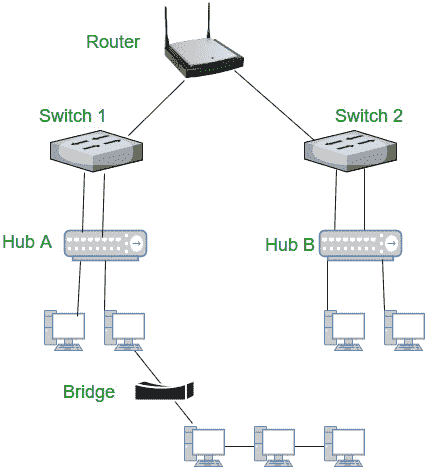

# 网络设备(集线器、中继器、网桥、交换机、路由器、网关和路由器)

> 原文:[https://www . geesforgeks . org/network-devices-hub-repeater-bridge-switch-router-gateway/](https://www.geeksforgeeks.org/network-devices-hub-repeater-bridge-switch-router-gateways/)

**1。中继器**–中继器在物理层工作。它的工作是在信号变得太弱或被破坏之前，在同一网络上重新生成信号，从而延长信号在同一网络上传输的长度。关于中继器需要注意的一点是，它们不会放大信号。当信号变弱时，他们一点一点地复制信号，并以原始强度再生。它是一个 2 端口设备。

**2。集线器**–集线器基本上是一个多端口中继器。集线器连接来自不同分支的多条电线，例如，星形拓扑中连接不同站点的连接器。集线器无法过滤数据，因此数据包会发送到所有连接的设备。换句话说，通过集线器连接的所有主机的[冲突域](https://en.wikipedia.org/wiki/Collision_domain)仍然是一个。此外，他们没有智能来找出数据包的最佳路径，这导致效率低下和浪费。

**轮毂类型**

*   **主动集线器:-** 这些集线器都有自己的电源，可以随着网络清理、升压和中继信号。它既是中继器又是布线中心。这些用于扩展节点之间的最大距离。
*   **无源集线器:-** 这些是从节点收集布线并从有源集线器收集电源的集线器。这些集线器将信号中继到网络上，而不清理和提升它们，并且不能用于扩展节点之间的距离。
*   **智能集线器:-** 它像主动集线器一样工作，并包括远程管理功能。它们还为网络设备提供灵活的数据速率。它还使管理员能够监控通过集线器的流量，并配置集线器中的每个端口。

**3。网桥**–网桥在数据链路层运行。网桥是一个中继器，通过读取源和目的地的 MAC 地址来增加过滤内容的功能。它也用于互连使用相同协议的两个局域网。它有一个输入和一个输出端口，因此它是一个 2 端口设备。

**桥梁类型**

*   **透明桥:-** 这些桥中的站完全不知道桥的存在，即无论桥是否从网络中添加或删除，站的重新配置都是不必要的。这些桥利用两个过程，即桥转发和桥学习。
*   **源路由桥:-** 在这些桥中，路由操作由源站执行，帧指定遵循哪条路由。主机可以通过发送一个称为发现帧的特殊帧来发现该帧，该帧通过所有可能的路径传播到整个网络。

**4。交换机**–交换机是一种多端口桥，具有缓冲区和可以提高其效率(大量端口意味着较少流量)和性能的设计。交换机是数据链路层设备。交换机可以在转发数据之前执行错误检查，这使得它非常高效，因为它不会转发有错误的数据包，而只会选择性地将好的数据包转发到正确的端口。换句话说，交换机划分了主机的冲突域，但[广播域](https://en.wikipedia.org/wiki/Broadcast_domain)保持不变。

**5。** [**路由器**](#Routers)–路由器是一种类似交换机的设备，它根据数据包的 IP 地址来路由数据包。路由器主要是网络层设备。路由器通常将局域网和广域网连接在一起，并有一个动态更新的路由表，路由器根据这个路由表来决定数据包的路由。路由器划分通过它连接的主机的广播域。

**6。网关**–顾名思义，网关是将两个网络连接在一起的通道，这两个网络可以在不同的网络模型上工作。他们基本上充当信使代理，从一个系统获取数据，解释数据，然后将数据传输到另一个系统。网关也称为协议转换器，可以在任何网络层运行。网关通常比交换机或路由器更复杂。网关也称为协议转换器。

**7。brouter**–它也被称为桥接路由器，是一种结合了网桥和路由器功能的设备。它可以在数据链路层或网络层工作。作为路由器，它能够跨网络路由数据包，作为网桥，它能够过滤局域网流量。

**8。网卡**–网卡或网络接口卡是一种网络适配器，用于将计算机连接到网络。它安装在计算机中以建立局域网。它有一个写在芯片上的唯一 id，它有一个连接器来连接电缆。电缆充当计算机和路由器或调制解调器之间的接口。网卡是第 2 层设备，这意味着它可以在网络模型的物理层和数据链路层工作。

**参考文献** :
[**数据通信与网络**](https://amzn.to/3vDy7ka)

如果你发现任何不正确的地方，或者你想分享更多关于上面讨论的话题的信息，请写评论。