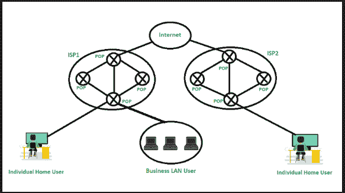

# POP 完整形式

> 原文:[https://www.geeksforgeeks.org/pop-full-form/](https://www.geeksforgeeks.org/pop-full-form/)

POP 代表**存在点(也称为邮局协议)**。

这是许多设备共享一个连接并可以相互通信的点。我们可以说，它是通信实体之间的一个人为分界点(公司的公共网络结束，客户的专用网络开始，例如，您的宽带电缆进入房屋的点)。它基本上由高速电信设备和技术组成，有助于将互联网上的人们聚集在一起。

这方面的一个例子是本地接入点，它通过互联网服务提供商(ISP)将客户与世界其他地方连接起来。互联网服务提供商的规模可以通过查看服务提供商拥有的持久性有机污染物的数量来计算。正常情况下，路由器、调制解调器、服务器、交换机和其他必须通过网络共享数据的设备都使用持久性有机污染物。互联网服务提供商有多种持久性有机污染物。

**POP 的特性:**

*   邮局协议是一个开放的协议，由互联网 RFC 定义。
*   它允许从各种客户端平台类型访问新邮件。
*   它支持下载和删除功能，即使离线。
*   由于其固有的性质，它不需要邮件网关。
*   POP 只能在电子邮件通过 SMTP 发送时处理电子邮件访问。

RFC 918 于 1984 年出版，它定义了邮局协议。图片中出现 POP 的原因是为了给客户端计算机提供一种更整洁的方式来检索 SMTP(简单邮件传输协议)服务器上的电子邮件，以便可以在本地使用。POP 第二版于 1985 年出版。

它通过进一步定义一组令人印象深刻的命令作为回复，即兴发挥了 POP 的功能。RFC 1939 于 1996 年出版，从那以后 POP3 就没有临时制作过。

**示例:**

*   **<u>开利酒店</u> :**
    这些建筑非常安全，平均面积约为 54，000 平方英尺。这些酒店提供硬件和软件安装、升级和其他一些服务。

*   **<u>Meet-me rooms</u> :** 
    Meet-Me Rooms (MMRs) are small space inside carrier hotels, averaging around 5, 000 square feet. These small rooms house interconnects networking equipment owned by many telecommunication companies. 

**图–**邮局协议(POP)

**工作:**
POP 的工作基于其五大重要设备，分别是:

1.  **基站–**接入点和带宽管理的中心参考点，以确保客户连接速度的均匀分布。
2.  **客户用来与基站链接的客户端设备–**
3.  **网络交换机–**用于正确分配
4.  **路由器–**为网络中共享的数据提供多条路径
5.  **防火墙–**用于保护网络免受威胁(内部和外部)

**优势:**
最新版本的邮局协议(POP3)是目前使用最广泛的协议，并且得到了大部分邮件客户端的支持。

它为用户访问邮箱和下载邮件提供了一种方便和标准的方式。这样做的一个重要优点是，邮件信息被发送到客户端电脑，无论是否访问网络，都可以阅读。

更多优势是:

*   如果没有登录到网络，就不可能创建最新消息
*   所有消息都存储在计算机的光盘驱动器上
*   易于使用和配置。
*   由于附件已经在您的电脑上，打开它们可能是一个更快的过程
*   您的邮箱没有任何最大大小，除非由光盘驱动器的大小决定

**缺点:**

*   由于所有消息都存储在光盘驱动器上，因此会消耗大量内存
*   打开附件可能是一个快速的过程，除非附件包含病毒
*   由于所有附件都是在你的电脑上下载的，如果它们没有被反病毒软件扫描，就有被病毒攻击的危险，因为这些扫描只有 60%的有效性
*   电子邮件不能被其他机器打开，除非它们被配置为这样做。
*   电子邮件文件夹可能会损坏，甚至可能会漂移。
*   将本地邮件文件夹导出到另一台物理机器或另一个邮件客户端并不容易。