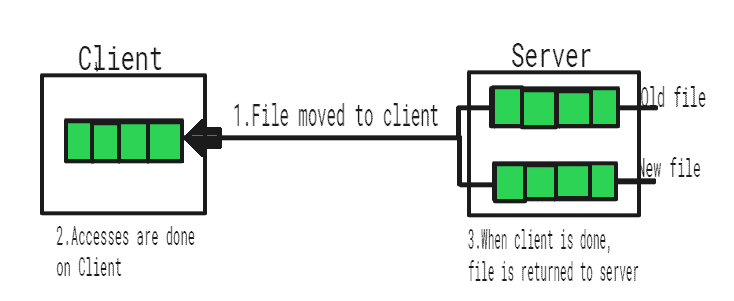

# 文件管理中的远程文件系统(RFS)

> 原文:[https://www . geesforgeks . org/remote-file-system-rfs-in-file-management/](https://www.geeksforgeeks.org/remote-file-system-rfs-in-file-management/)

文件可以通过各种方法在网络上共享–

*   使用 FTP，即文件传输协议，用于将文件从一台计算机传输到另一台计算机。
*   使用分布式文件系统(DFS)，其中远程目录在本地机器上可见。
*   使用远程文件系统，其中网络的到来允许远程计算机之间的通信。这些网络允许在全世界共享各种硬件和软件资源。

**远程文件共享(RFS)** 是一种类型的**分布式文件系统技术**。它是由 AT & T 在 1980 年开发的。后来，它与 UNIX 系统版本 V(五)版本 3 (SVR3)一起交付。它支持多个远程用户通过互联网或网络连接访问文件和/或数据。它也称为提供远程用户访问本地存储的文件和/或数据的一般过程。

它依赖于操作系统的流传输提供者接口功能。

为了实现远程文件系统，我们使用**客户端-服务器模型。**是远程文件系统的基础应用之一。

**RFS 中的客户端-服务器模型:**
RFS 允许计算机从一台或多台远程机器支持一个或多个文件系统。在这种情况下，包含文件的机器是服务器，想要访问文件的机器是客户端。服务器指定特定客户端可以访问哪个文件。文件通常在分区级别指定。

一个服务器可以服务**多个客户端**，一个客户端可以访问**多个服务器**，这取决于给定客户端-服务器设施的实现细节。一旦安装完毕，文件操作请求将代表用户通过网络发送到服务器。

**例如**，用户向服务器发送文件打开请求并附上其 ID。然后，服务器检查文件访问，以确定用户是否有权访问文件请求模式。该请求被允许或拒绝。如果允许，文件被返回给客户端应用程序，然后应用程序可以对文件执行读、写和其他操作。

执行所需操作后，客户端关闭文件。

