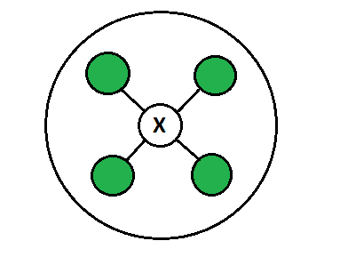
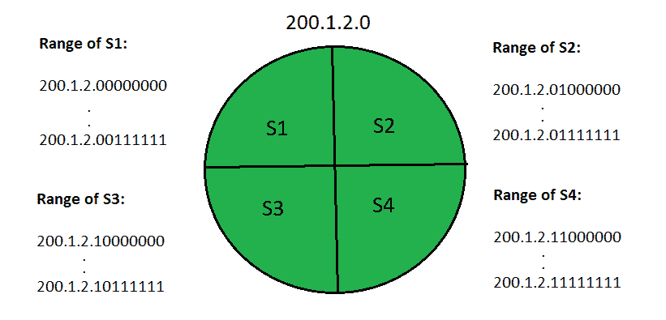

# 计算机网络中的路由表

> 原文:[https://www . geesforgeks . org/routing-tables-in-computer-network/](https://www.geeksforgeeks.org/routing-tables-in-computer-network/)

**[路由器](https://www.geeksforgeeks.org/introduction-of-a-router/) :**
路由器是在计算机网络之间转发数据包的网络设备。该设备通常连接到两个或多个不同的网络。当数据包到达路由器端口时，路由器会读取数据包中的地址信息，以确定数据包将发送到哪个端口。例如，路由器通过将局域网与互联网连接，为您提供互联网访问。



当数据包到达路由器时，它会检查收到的数据包的目的 IP 地址，并做出相应的路由决定。路由器使用*路由表*来确定数据包将发送到哪个接口。路由表列出了所有已知路由的网络。每台路由器的路由表都是唯一的，并存储在设备的内存中。

**路由表:**
路由表是一组规则，通常以表格格式查看，用于确定通过互联网协议(IP)网络传输的数据包将被定向到哪里。所有支持 IP 的设备，包括路由器和交换机，都使用路由表。请参见下面的路由表:

```
 Destination      Subnet mask         Interface
 128.75.43.0      255.255.255.0       Eth0
 128.75.43.0      255.255.255.128     Eth1
 192.12.17.5      255.255.255.255     Eth3
 default                              Eth2
```

对应于*默认*网关配置的条目是网络目的地为 0.0.0.0，网络掩码为 0.0.0.0。默认路由的子网掩码始终是 255.255.255.255。

**IP 路由表条目:**
路由表包含沿最佳路径向目的地转发数据包所需的信息。每个数据包都包含有关其来源和目的地的信息。路由表为设备提供了将数据包发送到网络路由下一跳的指令。

路由表中的每个条目由以下条目组成:

1.  **网络 ID:**
    路由对应的网络 ID 或目的地。
2.  **子网掩码:**
    用于将目的 IP 地址与网络 ID 匹配的掩码。
3.  **下一跳:**
    数据包被转发到的 IP 地址
4.  **输出接口:**
    输出接口数据包应该输出到目的网络。
5.  **度量:**
    度量的一个常见用法是指示*到网络 ID 的最小跳数*(路由器交叉)。

路由表条目可用于存储以下类型的路由:

*   直连网络标识
*   远程网络标识
*   主机路由
*   默认路由
*   目的地

> 当路由器收到数据包时，它会检查目的地的 IP 地址，并查看其**路由表**，以确定哪个接口数据包将被发送出去。

**路由表是如何填充的？**
维护路由表有几种方法:

*   直连网络会自动添加。
*   使用[静态路由](https://www.geeksforgeeks.org/difference-between-static-and-dynamic-routing/)。
*   使用[动态路由](https://www.geeksforgeeks.org/difference-between-static-and-dynamic-routing/)。

这些路由表可以手动或动态维护。在*动态路由*中，设备通过使用路由协议来交换关于周围网络拓扑的信息，从而自动构建和维护它们的路由表。动态路由表允许设备“监听”网络，并对设备故障和网络拥塞等事件做出响应。除非网络管理员手动更改，否则*静态网络设备*的表格不会更改。

**路由确定过程(使用路由表查找子网 ID):**
考虑一个网络被[划分为 4 个子网](https://www.geeksforgeeks.org/advantages-and-disadvantages-of-subnetting/)，如上图所示。4 个子网的 IP 地址是:

```
200.1.2.0 (Subnet a)
200.1.2.64 (Subnet b)
200.1.2.128 (Subnet c)
200.1.2.192 (Subnet d) 
```



然后，内部路由器维护的**路由表**看起来像:

<center>

| 目的地 | 子网掩码 | 连接 |
| --- | --- | --- |
| 200.1.2.0 | 255.255.255.192 | a |
| 200.1.2.64 | 255.255.255.192 | b |
| 200.1.2.128 | 255.255.255.192 | c |
| 200.1.2.192 | 255.255.255.192 | d |
| 默认 | 0.0.0.0 | e |

</center>

为了找到正确的[子网](https://www.geeksforgeeks.org/introduction-to-subnetting/)(子网 ID)，路由器对数据包中提到的目的 IP 地址和所有子网掩码进行逐位“与”运算。

*   如果只有一个匹配，路由器会在相应的接口上转发数据包。
*   如果出现多个匹配，路由器会在对应于最长子网掩码的接口上转发数据包。
*   如果不匹配，路由器会在默认条目对应的接口上转发数据包。

**例-1:** [GATE-CS-2004 |问题 55](https://www.geeksforgeeks.org/gate-gate-cs-2004-question-55/)

**示例-2:** [GATE IT 2006 |问题 63](https://www.geeksforgeeks.org/gate-gate-it-2006-question-63/)

**请注意**路由表并不特定于思科设备。甚至您的 Windows 操作系统也有一个路由表，可以使用路由打印命令显示