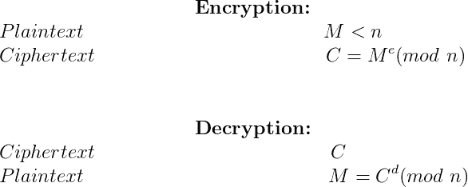

# 使用多精度算术库的 RSA 算法

> 原文:[https://www . geesforgeks . org/RSA-算法-使用-多精度-算术-库/](https://www.geeksforgeeks.org/rsa-algorithm-using-multiple-precision-arithmetic-library/)

公钥密码系统也称为非对称密码系统，是一种使用两种密钥即公钥和私钥的密码系统。发送方使用接收方的公钥加密明文，而接收方的私钥用于解密加密的消息，因此只能由预期的接收方解密。
RSA (Rivest Shamir Adleman)是一种公钥密码算法，其密钥生成是基于两个大素数 p 和 q 的乘积生成 N，即 N = p × q，该算法安全性的关键在于攻击者需要先通过指数时间内发生的 N 的因式分解找出 p 和 q。研究表明，如果 N 是 100 位数，这可能需要 70 多年。由于这种复杂性，攻击者无法找到解密密钥 d，因为 d 依赖于 p、q 和加密密钥 e。因此，即使攻击者知道 N 和 e，也无法计算 d。

**RSA 当前场景:**
截至 2017 年 4 月，RSA-2048 可能在未来很多年内都无法分解。此外，最近的[勒索软件](https://en.wikipedia.org/wiki/Ransomware)病毒也使用 RSA-2048 加密受感染系统上的文件。这些文件在没有解密密钥的情况下无法解密，因为这么大的密钥无法分解。因此，RSA-1024 和 RSA-2048 现在被广泛用于安全通信。




上面的图片显示了 RSA 算法的 3 个不同阶段。考虑到素数生成器生成 1024 位素数 p 和 q，结果 N 将是 2048 位数。因为在加密和解密期间执行的所有模运算都是针对 N(2048 位数字)的，所以这种方式的软件实现可能很耗时。此外，C 的无符号长整型数据类型将计算限制为 64 位数字。为了支持作为 RSA 算法的要求的大尺寸密钥的生成和涉及大尺寸模数的加密和解密的快速计算，可以使用称为 GMP (GNU 多精度算术库)的库。使用该库将允许整个 RSA 算法在简单的 64 位操作系统上运行，从而避免使用超级计算机或高配置硬件设备。

**什么是 GMP？**
[GMP](https://gmplib.org/) 是一个开源库，允许对有符号整数、有理数和十进制数进行算术计算，除了运行机器的配置之外，对其精度没有任何实际限制。该库用于那些涉及非常大或高精度数字的算术计算，其中大多数用于加密算法。使用这个库的好处是，它支持任意精度的数字，在程序执行之前，这些数字的大小是未知的。为使用这个库提供的基本接口是为 C 语言提供的。但是其他语言也有包装器，包括 Ada、C++、C#、Julia、OCaml、Perl、PHP、Python、R、Ruby 和 Wolfram 语言。
下面以一个执行两个多精度数相乘的 C 程序为例进行说明。
**注意**需要将 gmp.h 文件作为头文件包含进来。在 Unix 系统上编译这样的程序可以使用命令
来完成

```
gcc program_name.c -lgmp
```

## C

```
#include <stdio.h>
#include <gmp.h>

int main(void) {
   mpz_t x, y, result;

   mpz_init_set_str(x, "7612058254738945", 10);
   mpz_init_set_str(y, "9263591128439081", 10);
   mpz_init(result);

   mpz_mul(result, x, y);
   gmp_printf("    %Zd\n"
              "*\n"
              "    %Zd\n"
              "--------------------\n"
              "%Zd\n", x, y, result);

   /* free used memory */
   mpz_clear(x);
   mpz_clear(y);
   mpz_clear(result);

   return 0;
}
```

**对 RSA 算法进行编码:**
一个用小素数描述 RSA 算法工作原理的 C 程序在这里可以获得。为了理解使用大素数的真实 RSA 算法的工作原理，这里[提供了一个使用 GMP 库的 C 代码](https://github.com/gilgad13/rsa-gmp/blob/master/rsa.c)。这个程序通过生成随机的 512 位素数 p 和 q，然后进行加密和解密来实现 RSA-1024。这里，变量 MODULUS _ SIZE 被赋予值 1024。该值可以更改为 2048，以生成 2048 位的 RSA 密钥。

**应用:**
RSA 算法已被广泛应用于安全网络通信和安全交易的众多电子商务应用中。其他应用包括低比特率信道上的语音通信、甚至高速 IPSec 的安全密钥交换、与在线商家通信时的信用卡详细信息等。