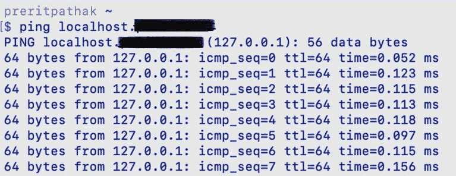

# 相同站点脚本

> 原文:[https://www.geeksforgeeks.org/same-site-scripting/](https://www.geeksforgeeks.org/same-site-scripting/)

同站点脚本是一种由常见的[域名系统](https://www.geeksforgeeks.org/domain-name-system-dns-in-application-layer/)错误配置导致的漏洞。但是在我们深入概念之前，让我们确保对互联网是如何工作的有基本的了解。

**网络工作:**
当你试图访问一个网站时，你的浏览器通过使用 IP(互联网协议)与该网站所在的网络服务器通信。IP 使用 IP 地址来访问这些服务器。

以下是访问网站过程的基本解释

1.  你试着去 target.com。
2.  浏览器用 [DNS(域名系统)](https://www.geeksforgeeks.org/domain-name-system-dns-in-application-layer/)把“target.com”翻译成它的 IP 地址，比如说“1.1.1.1”。
3.  “target.com”的内容显示在您的浏览器上。

**DNS 错误配置:**
我们来看看 DNS 错误配置是什么意思。在上面的例子中，如果 DNS 服务器返回错误的 IP 地址，如 2.2.2.2 而不是 1.1.1.1，浏览器成功访问 2.2.2.2。现在，如果恶意网站在 2.2.2.2 托管，受害者可能会在很多方面受到伤害。如果不使用传输层安全性(TLS)连接到 2.2.2.2，这是一个问题。另一方面，如果使用 TLS，浏览器会拒绝连接到 2.2.2.2，因为它没有与 target.com 证书匹配私钥。

**相同站点脚本:**
配置名称服务器时的一个常见做法是安装以下类型的记录。

```
localhost. IN A 127.0.0.1

```

一个看似无害的错误是在末尾省略了尾随点。服务器解析配置文件的方式是将 localhost 解释为当前域中的主机名，而不是域本身。这意味着，如果您尝试对 localhost.target.com 使用 ping 命令，查询将会解析。



同一站点脚本漏洞

这引入了一个名为“同站点脚本”的漏洞，它是跨站点脚本(XSS)的变体。由于点不在网址的末尾，这表明记录不是完全合格的。因此，解析了“localhost.target.com”形式的查询。

因此，基本上，环回地址(对计算机来说简单地意味着“我自己”)被分配给 localhost.target.com 的这个可路由地址。因此，当你试图连接到这个环回地址时，你将连接到发送消息的机器。

**示例–**
当您尝试访问 localhost.target.com 时，如果您的本地主机上运行有服务(如 WAMP 服务器等)。)您将被重定向到该页面，并且无法访问子域。

**影响:**
这不是 XSS 那样的高严重性漏洞，至于利用这个漏洞，攻击者需要和你在同一台机器上。如果没有，他们就不能打开网络端口，通过这个端口，他们可以从本地机器向您的浏览器提供 HTTP 流量。

**攻击场景:**
这种 DNS 错误配置使得受害者在使用多用户系统时容易受到攻击。

1.  在共享 UNIX 系统上，攻击者监听非特权端口[0]，然后使用典型的 XSS 攻击向量(例如，img src = …)引诱受害者请求“http://localhost . target . com:1024/cute dogs . gif”。
2.  当受害者试图访问上述网址时，显示的响应类似于“加载图像失败”。
3.  然而，在后台，请求被记录。

**作为管理员如何避免同站点脚本:**

1.  对于托管依赖 HTTP 状态管理的网站的域，应从名称服务器配置中删除非 FQ 本地主机条目。
2.  此外，那些通过域名系统实施黑洞路由以减轻针对特定主机名的拒绝服务攻击的人应该避免将目标解析为 127.0.0.1 或敏感域的类似地址的诱惑。