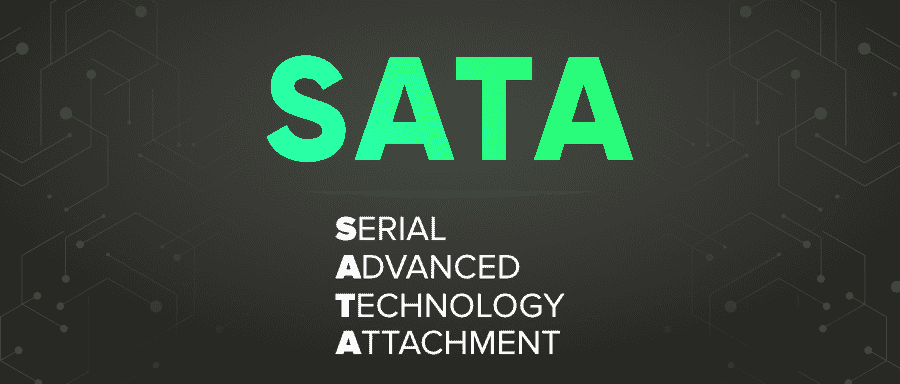

# SATA 完整版

> 原文:[https://www.geeksforgeeks.org/sata-full-form/](https://www.geeksforgeeks.org/sata-full-form/)

**SATA** 代表**串行高级技术附件或串行 ATA** 。

SATA 是一个**接口，将硬盘、光驱、固态硬盘等各种存储设备连接到主板**。SATA 于 2000 年推出，以取代长期存在的 PATA(并行 ATA)接口。我们都知道，在串行模式下，数据是一点一点地传输的，在并行模式下，有几个流携带数据。尽管知道这个事实，但 PATA 有一个缺点。PATA 极易受到外部干扰，因此允许 SATA 以比 PATA 更高的速度运行。与 PATA 电缆相比，SATA 电缆更薄、更灵活、更紧凑。

2000 年代末，有几个行业团体开始在 SATA 领域发展。直到 2003 年，SATA-IO (SATA 国际组织)才成立，并制定了第一个 SATA 规范。

**SATA 控制器是用于将计算机主板连接到存储驱动器的设备。**

SATA 以两种模式运行–

1.  **IDE 模式:** IDE 代表集成驱动电子设备。这是一种模式，用于以低性能为代价，提供与运行在 PATA 上的旧硬件的向后兼容性。
2.  **AHCI 模式:** AHCI 是高级主机控制器接口的缩写。AHCI 是一种高性能模式，也支持热插拔。

#### SATA 的特性

*   **低电压要求:** SATA 采用 500mV (0.5V)峰峰值信号工作。这有助于提高导体之间的低得多的干扰和串扰。
*   **简化结构:** PATA 电缆采用 40 针/80 线带状电缆。这个建筑很复杂。相比之下，SATA 只有一根 7 针数据线和一根 15 针电源线。这种电缆提高了信号传输速率，从而加快了数据吞吐量。
*   **差分信令:** SATA 使用差分信令。差分信号是一种使用两条相邻导线同时传输同相和异相信号的技术。因此，通过在接收器端检测两个信号之间的相位差，可以以低工作电压和低功耗传输高速数据。
*   **高数据传输速率:** SATA 的高数据传输速率为 150/300/600 MBs/秒。SATA 的这种能力允许更快的程序加载、更好的图片加载和更快的文档加载。

#### SATA 的优势

*   与 PATA 相比，数据传输速度更快。
*   SATA 电缆最长可达 1 米，而 PATA 电缆最长只能有 18 英寸。
*   SATA 电缆尺寸较小。
*   因为它们的尺寸较小，所以它们在计算机内部占用的空间较少，并且增加了内部空气流量。增加空气流量可以减少热量积累，从而延长计算机的整体寿命。
*   当今大多数现代计算机主板的 SATA 端口都比 PATA 端口多。
*   低功耗(0.5V)。

#### SATA 的缺点

*   有时需要特殊的设备驱动程序来识别和使用驱动器。然而，SATA 硬盘可以像 PATA
    驱动器一样工作。这消除了安装特定驱动程序的需要。
*   SATA 电缆一次只支持连接一个硬盘，而 PATA 电缆允许每根电缆最多连接两个 PATA 驱动器。
*   与 PATA 相比，SATA 的价格更高。