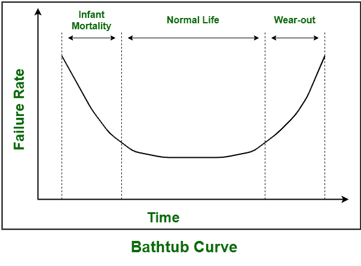

# 浴缸曲线上的短音符

> 原文:[https://www.geeksforgeeks.org/short-note-on-bathtub-curve/](https://www.geeksforgeeks.org/short-note-on-bathtub-curve/)

浴缸曲线通常是一种图表，用于图形化演示从运行到故障的维护策略。这条曲线简单地代表了资产的整个生命周期和资产总体的故障率随时间的变化。浴缸曲线通常被认为是资产可靠性最有用和最基本的图形表示之一。

资产通常是设备、组件或设备部件等。借助这样的图表，人们可以确定和预测故障通常何时发生，然后找出根本原因。确定根本原因后，只需简单地解决根本原因，就可以防止故障的发生。它之所以被称为浴缸曲线，仅仅是因为曲线像浴缸的纵截面。

**曲线不同段:**
浴缸曲线基本分为三个不同段。资产在其一生中通常面临这三个部分。浴缸曲线的三个不同部分如下所示–

*   **婴儿死亡率段:**
    婴儿死亡率段简称早期衰竭期。通过看到曲线，人们可以很容易地理解，在这一部分，资产是第一次开始使用。最初，故障率，即故障发生的概率非常高，并且随着时间的增加，故障率逐渐降低。在本节中，故障通常是由于制造缺陷、安装问题、设计问题、材料缺陷或启动程序不当等造成的。

*   **Normal Life Section :**
    Normal life section is simply referred to as usual life period or steady-state operation. It can also be said that this section represents normal operating life of assets. By seeing curve, one can easily understand that in this section, asset is still experiencing failure but at normal and low rate. In this section, failures are usually occurred due to overloading, hidden defects, collision with other objects, mistakes of personnel, etc.

    故障的发生通常取决于特定资产的功能和状况。因此，对于不同的评估，失败率可能不同。在此期间或部分，资产可以在一段时间内保持未检查状态，因为在此期间发生故障的可能性很低，因此资源可以在任何需要的地方使用。在这个阶段，故障率几乎是恒定的。可以说，故障通常是由于随机事件而发生的。

*   **磨合期:**
    磨合期简称老化期。通过看曲线，很容易理解，在这一节中，资产的失败率随着时间的增加而逐渐增加。资产发生故障的次数通常会随着时间的推移而增加。在这一部分中，故障通常是由于疲劳、磨损、逐渐恶化、腐蚀等而发生的。这个时期仅仅代表资产生命周期的结束。