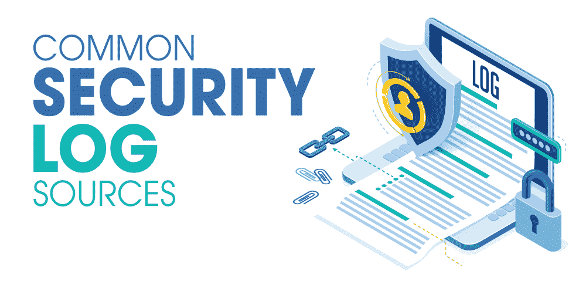

# 9 大常见安全日志来源

> 原文:[https://www . geesforgeks . org/top-9-common-security-log-sources/](https://www.geeksforgeeks.org/top-9-common-security-log-sources/)

日志生成和分析是信息技术行业的重要组成部分。这是一个审查、检查和理解日志文件(如网络和系统日志文件)以获得有价值见解的过程。这些也有助于破解哪里出了问题，以及如何识别网络安全攻击。这些安全日志文件包含时间戳，这些时间戳提供了当某个事件导致特定故障或出错时发生了什么事件的详细信息。了解不同类型的安全日志源非常重要，因此现在让我们详细了解最常见的安全日志源。

### 1.Sysmon 日志

***系统监视器(或 Sysmon)*** 是微软提供的一款免费软件工具/设备驱动程序，用于监视系统活动并将其记录到 Windows 事件日志中。它在一个地方创建各种活动的日志，如进程创建、网络连接、文件创建或修改、驱动程序加载、原始磁盘访问、远程线程、进程内存访问。它定期从微软获得更新，新功能定期推出。通过分析这些日志，可以轻松识别任何恶意活动，并有助于了解入侵者试图如何在您的网络上操作。限制是它不会对对手隐藏，也不会生成它生成的事件日志。

### 2.Windows 安全日志

它是一个日志，根据系统的审核策略维护与安全相关的活动。这是一个很好的工具，可以查看尝试和成功的未授权活动，并解决问题。日志和策略由系统管理员管理，这意味着他可以删除特定的日志，分离权限，甚至清除日志。这意味着一旦管理员的帐户遭到破坏，安全日志就不能被信任。它还列出了登录/注销活动，给出了系统登录的帐户和 IP 地址、权限和策略更改、系统事件和进程跟踪。

### 3.视窗系统日志

它是应用程序和系统事件的事件日志，还包括一些错误或警告消息。它有助于几乎各种不同的 windows 问题的故障排除。它记录像 Windows 系统组件这样的日志，像驱动程序和内置接口组件，以及与安装在系统上的程序相关的日志。它还跟踪系统引导时间的日志。它使用事件标识符来唯一定义计算机可能遇到的可识别事件。它有时会显示基本的错误，这些错误不会造成任何伤害，但会被骗子用来操纵用户，让他们认为这是危险的，然后要求他们的凭据，让他们认为他们会修复它。

### 4.网络流日志

它是思科开发的网络协议。它监控网络流量和流量，并从路由器和交换机收集 IP 流量信息。使用网络流收集器和分析器，可以看到流量来自和去往哪里，以及通过接口产生了多少流量。它监控网络带宽和流量模式。网络管理员可以使用 Netflow 日志来识别消耗带宽最多的用户、协议或应用程序，以及网络拥塞的原因。

### 5.PCAP 日志

数据包捕获(PCAP)是一种用于收集网络流量的应用程序编程接口。它用于捕获数据包，甚至将这些捕获保存到文件中，并读取包含已保存数据包的文件。应用程序包括网络统计信息收集、安全监控和网络调试。它支持多种软件工具，在这些工具中，保存的打包文件可以被馈送以获得用户友好的分析输出。它可以检查 IP 地址、策略、域名、IP 类型、时间戳、源端口等等。

### 6.防火墙日志

它记录了防火墙如何处理流量类型，并提供了对源和目标 IP 地址、协议和端口号的洞察。它还通过识别可疑连接来指示网络中何时存在恶意活动。Windows 防火墙日志会显示连接的时间和日期、连接类型(TCP/UDP)、计算机上使用的端口、丢弃或接受的数据包。它还允许根据防火墙的带宽使用情况来规划带宽需求。它向网络管理员提供实时信息，以发现任何可疑活动。

### 7.代理日志

它们包含访问您网络的用户和应用程序的日志。除了用户的网站请求，它还包括应用程序或服务请求。他们跟踪的信息包括日期和时间、HTTP 协议版本、HTTP 请求方法、内容类型、用户代理、经过身份验证的客户端用户名、客户端 IP 和源端口、代理操作、请求的资源等等。在事件响应期间，还可以根据代理服务器日志的内容发出警报。

### 8.浏览器历史日志

浏览器历史记录就像是一张地图，显示了您访问不同网页和应用程序的内容和时间。他们会泄漏大量的数据来确定用户访问的来源。可以使用各种技术来利用它，如 CSS 颜色选择器(大部分在较新的浏览器中打补丁)，使用缓存的数据计时，通过浏览器应用编程接口，插件可以被黑客攻击，或者网络通信可以在机器外部被拦截。浏览器日志告诉取证人员访问的网站、时间戳、被访问的次数、输入的数据或下载的内容。

### 9.域名系统日志

它提供了有关 DNS 服务器发送和接收的 DNS 数据的极其详细的信息。DNS 攻击包括 DNS 劫持、DNS 隧道、拒绝服务(DoS)攻击、命令和控制以及缓存中毒。因此，域名系统日志有助于识别与这些攻击相关的信息，以便找到来源。这些包括请求的记录、客户端 IP、请求标志、区域传输、查询日志、速率计时和 DNS 签名的详细数据。