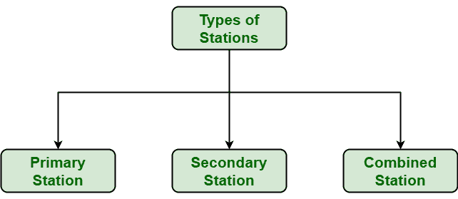

# HDLC 协议站类型

> 原文:[https://www . geeksforgeeks . org/站类型-for-hdlc-protocol/](https://www.geeksforgeeks.org/type-of-stations-for-hdlc-protocol/)

[高级数据链路控制(HDLC)](https://www.geeksforgeeks.org/difference-between-high-level-data-link-control-hdlc-and-point-to-point-protocol-ppp/) 基本上是面向比特的通信协议，这意味着它使用比特填充来实现数据链路层(DLL)中非常点对点和多点链路上的数据透明。透明度基本上是数据与控制信号的分离。HDLC 源自同步数据链控制。

HDLC 是[数据链路层](https://www.geeksforgeeks.org/data-link-layer-in-osi-model/)中最重要和最基本的协议。数据也被组织并划分成小单元，也称为数据帧，并通过网络传输到目的地，目的地验证并确保数据成功到达。国际电信联盟(ITU)只是为了在 X.25 网络接口中使用而修改了 HDLC，并将其称为 LAPB(平衡链路接入协议)。它是最重要的协议，原因如下:

*   HDLC 高度发达，被国际标准化组织用于点对点通信。
*   HDLC 使用与其他基本数据链路协议类似的格式和机制。
*   它还支持全双工通信或传输以及半双工通信或传输。

**站型:**
HDLC 一般规定数据链路控制的三种站型如下:

1.  **Primary Station :**
    Primary Station simply takes care of data link management. The main responsibility of primary station is to control operation of all other stations on links. It usually acts as master and controls operation of secondary stations and also handles error recovery at data link layer. It also manages and controls connection to all secondary sessions by sending commands.

    主要问题基本上是命令，次要问题基本上是响应。命令实际上是由这个主站发出的帧。该站还负责错误检测、线路控制和数据流控制。要与二级站通信，需要使用不平衡模式。主站负责在主站和次站之间通信的情况下连接和断开数据链路。

2.  **Secondary Station :**
    Secondary stations generally give responses to commands that are sent from primary station. This station act as slave and basically operates and works under control of primary station. It only transmits or sends response frame when this response frame is being requested by primary station. Responses are frames that are issued by secondary station. These stations are usually terminals that are attached to mainframes.

    二级站没有能力或直接负责控制数据链路。不平衡模式是主站和次站之间的通信。

3.  **Combined Station :**
    Combined Station as name suggests generally acts as combination of both primary and secondary stations. It establishes and tears down their own connections. The combined station usually issues both command or response. The balanced mode is communication among two combined stations. Each of combined stations is fully in control of itself and does not even rely on any of other stations on data link.

    组合站通常用于点对点串行链路，如连接到 CSU/DSU(信道服务单元/数据服务单元)的 V.35 链路，或通过 T1 或帧中继连接的各种路由器。