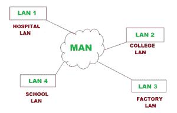

# 局域网、城域网和广域网的类型

> 原文:[https://www . geesforgeks . org/局域网类型-局域网-城域网/](https://www.geeksforgeeks.org/types-of-area-networks-lan-man-and-wan/)

**网络**允许计算机**通过任何媒介与不同的计算机连接和通信**。局域网、城域网和广域网是三种主要的网络类型，旨在覆盖它们所覆盖的区域。它们之间有一些相似之处和不同之处。其中一个主要区别是它们覆盖的地理区域，即**兰**覆盖的面积最小；**城域网**的面积比局域网大，**广域网**的面积最大。
还有其他类型的计算机网络，如:

*   个人区域网
*   存储区域网络
*   EPN(企业专用网)
*   虚拟专用网络

#### 局域网–

局域网或局域网以个人计算机和工作站可以共享数据、工具和程序的方式连接网络设备。一组计算机和设备通过交换机或交换机堆栈连接在一起，使用由 TCP/IP 协议定义的私有寻址方案。私有地址相对于本地网络上的其他计算机是唯一的。路由器位于局域网的边界，将它们连接到更大的广域网。

由于连接的计算机数量有限，数据传输速度非常快。根据定义，连接必须是高速且相对便宜的硬件(如集线器、网络适配器和以太网电缆)。局域网覆盖较小的地理区域(大小限于几公里)并且是私有的。人们可以将其用于办公楼、家庭、医院、学校等。局域网易于设计和维护。用于局域网的通信介质有双绞线和同轴电缆。它覆盖的距离很短，因此误差和噪声最小。

早期局域网的数据速率在 4 到 16 兆位/秒之间。今天，速度通常是 100 或 1000 兆位/秒。在局域网中，传播延迟非常短。最小的局域网可能只使用两台计算机，而较大的局域网可以容纳数千台计算机。局域网通常主要依靠有线连接来提高速度和安全性，但无线连接也可以是局域网的一部分。局域网的容错能力更强，网络拥塞更少。例如，一群学生在同一个房间(没有互联网)玩反罢工。

#### 城域网-

城域网覆盖的面积比局域网大，比广域网小。它连接两台或多台相隔但位于相同或不同城市的计算机。它覆盖很大的地理区域，可以作为互联网服务提供商。城域网是为需要高速连接的客户设计的。城域网的速度以兆位/秒为单位。很难设计和维护一个城域网。

城域网的容错性较低，网络中的拥塞也较多。它的成本很高，可能归一个组织所有，也可能不归一个组织所有。城域网的数据传输速率和传播延迟适中。用于通过城域网传输数据的设备有调制解调器和有线/电缆。城域网的例子是电话公司网络的一部分，可以向客户提供高速 DSL 线路或城市中的有线电视网络。

#### 广域网–

广域网是一种延伸到一个大的地理区域的计算机网络，尽管它可能被限制在一个州或国家的边界内。广域网可以是通过电话线和无线电波连接到其他局域网的局域网连接，可能仅限于企业(公司或组织)或公众可以访问。这项技术速度快，相对昂贵。

广域网有两种类型:交换广域网和点对点广域网。广域网很难设计和维护。类似于城域网，广域网的容错性更低，网络中的拥塞更严重。用于广域网的通信媒介是公共交换电话网或卫星链路。由于长距离传输，广域网中的噪声和误差往往更大。

广域网的数据速率大约是局域网速度的十分之一，因为它涉及到距离的增加和服务器和终端数量的增加等。广域网的速度从每秒几千比特到每秒几兆比特不等。传播延迟是这里面临的最大问题之一。用于通过广域网传输数据的设备有光纤、微波和卫星。交换广域网的一个例子是异步传输模式(自动柜员机)网络，点对点广域网是将家庭计算机连接到互联网的拨号线路。

结论–

局域网相对于城域网和广域网有很多优点，比如局域网可靠性高，数据传输速率高，易于管理，还可以共享外围设备。局域网不能覆盖城市或城镇，为此需要一个城域网，它可以将一个城市或一组城市连接在一起。此外，要连接一个国家或一组国家，需要一个广域网。