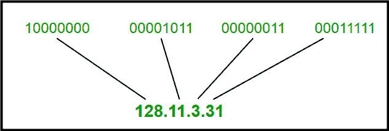
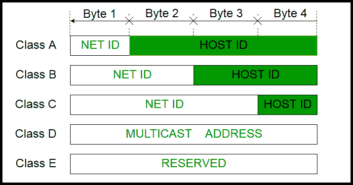

# 甲类网络地址的有效范围是多少？

> 原文:[https://www . geesforgeks . org/a 类网络地址的有效范围是多少/](https://www.geeksforgeeks.org/what-is-the-valid-range-of-a-class-a-network-address/)

首先让我们知道什么是 IP 地址，如果你已经知道，跳过这一节。

**IP(互联网协议):**
在互联网上进行通信是最基本的协议之一。IP 描述了网络设备如何寻址和路由信息。IP 地址是识别互联网上的计算机或其他设备的号码。一个简单的例子可能是邮寄地址。

```
There are 2 types of IP
1\. IPv4 : 32 bit long, Ex: 35.244.11.196
2\. IPv6 : 128 bit long, it is so much longer than IPv4
```

【IPv4 示例:

1.点分十进制符号



IPv4: 32 位长(点分十进制)

2.十六进制表示法


IPv4: 32 位长(Heaxadecimal)

**类寻址:**

*   因此，在 IPv4 寻址中，有 5 个类别来划分 IP 值:A 类、B 类、C 类、D 类和 e 类
*   第一个八位字节中的比特顺序决定了 IP 地址的类别。
*   IPv4 地址分为两部分:
    1。网络 ID
    2。主机标识
*   该类可以确定用于网络标识和主机标识的位。
*   可以计算出该特定类别中可能的网络和主机总数。
*   常用的只有 A 类、B 类和 C 类。D 类和 E 类是保留类，D 类用于多播组，E 类用于将来的目的。



**甲级:**

*   属于 A 类的 IP 地址被分配给包含大量主机的网络。在这里，A 类可以支持 127 个网络上的 1600 万台主机。
*   这里，网络标识长 8 位，主机标识长 24 位。
*   属于 A 类的 IP 地址范围从 1 . x . x . x–126 . x . x . x
*   默认子网掩码:255.x.x.x


```
Number Of Hosts and Networks:

Number of Hosts: (2^24)-2= 16,777,214 i.e 16 million hosts
Number of Networks: (2^7)-2=126 
Note: Reducing 2 because, 0.0.0.0 and 127.a.b.c are different addresses
```

**>>A 级的范围是 1.0.0.1 到 126.255.255.254**

**<u>其他类</u>**

乙类:128.1.0.1 至 191.255.255.254
丙类:192.0.1.1 至 223.255.254.254
丁类:244.0.0.0 至 239.255.255.255
戊类:244.0.0.0 至 254.255.255.254

参考文献:[https://www . geeksforgeeks . org/有类 ip 地址介绍/](https://www.geeksforgeeks.org/introduction-of-classful-ip-addressing/)