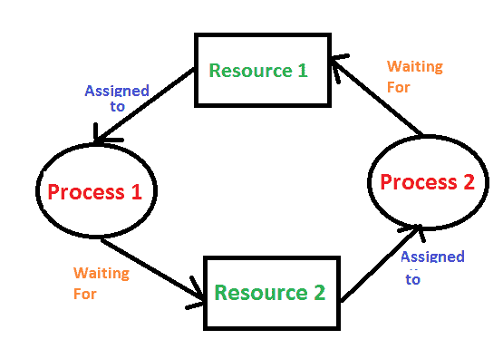

# 死锁检测和恢复

> 原文:[https://www.geeksforgeeks.org/deadlock-detection-recovery/](https://www.geeksforgeeks.org/deadlock-detection-recovery/)

在前一篇文章中，我们已经讨论了[死锁预防和避免](https://www.geeksforgeeks.org/deadlock-prevention/)。本文讨论了处理死锁的死锁检测和恢复技术。

**死锁检测:**

**1。如果资源只有一个实例–**
在这种情况下，对于死锁检测，我们可以运行一个算法来检查资源分配图中的周期。图中循环的存在是死锁的充分条件。

**2。**在上图中，资源 1 和资源 2 只有一个实例。有一个循环 R1 → P1 → R2 → P2。因此，死锁得到确认。

**3。如果有多个资源实例–**
检测周期是死锁检测的必要条件，但不是充分条件，在这种情况下，系统是否死锁根据不同的情况而有所不同。

**死锁恢复:**
Windows 等传统操作系统不处理死锁恢复，因为这是一个耗时耗空间的过程。实时操作系统使用死锁恢复。

1.  **杀死进程–**
    杀死死锁中涉及的所有进程。杀人过程一个接一个。在终止每个进程后，再次检查死锁，继续重复该进程，直到系统从死锁中恢复。逐个杀死所有进程有助于系统打破循环等待状态。
2.  **资源抢占–**
    资源从死锁中涉及的进程中被抢占，被抢占的资源被分配给其他进程，这样就有可能从死锁中恢复系统。在这种情况下，系统进入饥饿状态。