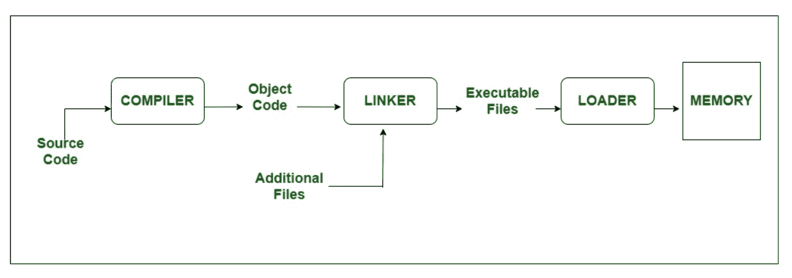

# 链接器和加载器的区别

> 原文:[https://www . geesforgeks . org/链接器和加载器之间的区别/](https://www.geeksforgeeks.org/difference-between-linker-and-loader/)

在程序的执行中，两个名为**链接器**和**加载器的实用程序扮演了主要角色。**

**1。** [**链接器**](https://www.geeksforgeeks.org/linker/) **:**
链接器是一种特殊的程序，它将编译器/汇编器生成的目标文件和其他代码组合在一起，生成一个可执行文件。exe 扩展名。在目标文件中，链接器搜索并附加文件执行所需的所有库。它控制存储每个模块代码的存储空间。它还合并两个或多个独立的目标程序，并在它们之间建立链接。通常，接头有两种类型:

```
1. Linkage Editor
2. Dynamic Linker 
```



**2。加载程序:**
加载程序是一种特殊的程序，它从链接器获取目标代码的输入，将其加载到主内存中，并准备这些代码供计算机执行。加载程序为程序分配内存空间。甚至它确定了对象之间的符号引用。它负责在操作系统中加载程序和库。嵌入式计算机系统没有加载器。其中，代码通过只读存储器执行。有以下各种装载方案:

```
1\. Absolute Loaders
2\. Relocating Loaders
3\. Direct Linking Loaders
4\. Bootstrap Loaders
```

**链接器和加载器的区别:**

<figure class="table">

| 没有。 | 连接物 | 装货设备 |
| one | 链接器的主要功能是生成可执行文件。 | 而 Loader 的主要目标是将可执行文件加载到主内存中。 |
| Two | 链接器接受编译器/汇编器生成的目标代码的输入。 | 加载器接受链接器生成的可执行文件的输入。 |
| three | 链接可以定义为组合各种代码和源代码以获得可执行代码的过程。 | 加载可以被定义为将可执行代码加载到主存储器以供进一步执行的过程。 |
| four | 链接器有两种类型:链接编辑器和动态链接器。 | 加载程序有 4 种类型:绝对、重定位、直接链接、引导。 |
| five | 链接器的另一个用途是组合所有的对象模块。 | 它有助于将地址分配给可执行代码/文件。 |
| six | 链接器还负责在程序的地址空间中排列对象。 | Loader 还负责调整程序中使用的引用。 |

</figure>