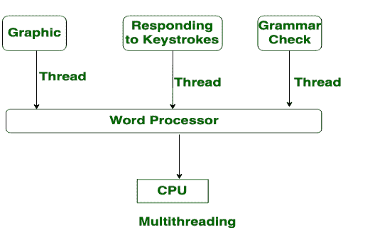

# 多道程序和多线程的区别

> 原文:[https://www . geesforgeks . org/多道程序和多线程之间的区别/](https://www.geeksforgeeks.org/difference-between-multiprogramming-and-multithreading/)

**1。多程序设计:**
多程序设计是一次运行多个进程，它通过组织作业(代码和数据)来提高 CPU 利用率，使 CPU 始终有一个要执行。动机是在主内存中保留多个作业。如果一个作业被输入/输出占用，可以将 CPU 分配给其他作业。

**2。多线程:**
多线程是一种在进程中创建多个线程以提高系统计算速度的技术。在多线程中，一个进程的多个线程同时执行，多线程中的进程创建是根据经济性来完成的。

**多道程序和多线程的区别:**

| 没有。 | 多道程序设计 | 多线程操作 |
| 1. | 主存储器中多个程序的并发应用称为多道程序设计。 | 该进程被分成几个不同的子进程，称为线程，有自己的执行路径。这个概念被称为多线程。 |
| 2. | 处理这些工作需要更多的时间。 | 作业处理需要适度的时间。 |
| 3. | 在这种情况下，一次执行一个进程。 | 在这种情况下，同一进程的不同组件同时执行。 |
| 4. | 用户数量是一次一个。 | 用户数量通常是一个。 |
| 5. | 吞吐量更少。 | 吞吐量适中。 |
| 6. | 它的效率更低。 | 其效率适中。 |
| 7. | 很经济。 | 很经济。 |
| 8. | CPU 的数量是一个。 | 中央处理器的数量可以是一个或多个。 |

