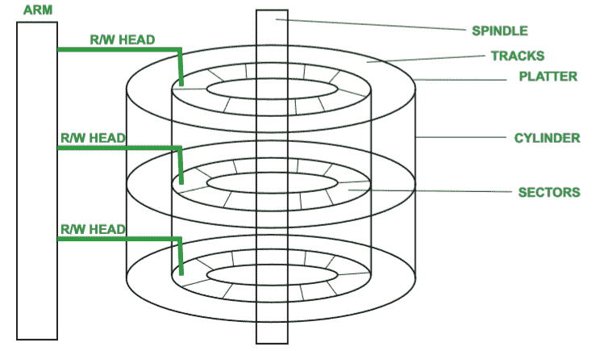

# 磁盘调度中旋转延迟和磁盘访问时间的差异

> 原文:[https://www . geesforgeks . org/旋转延迟和磁盘访问时间之间的差异磁盘调度/](https://www.geeksforgeeks.org/difference-between-rotational-latency-and-disk-access-time-in-disk-scheduling/)

**1。旋转延迟:**
旋转延迟也称为旋转时间。当读/写磁头到达精确的扇区时，磁盘旋转磁道所用的时间量，或者我们也可以说，期望的扇区到达读/写磁头下方所用的时间称为旋转延迟。旋转延迟取决于主轴的旋转速度。

```
Rotational Latency, 
= (Angle between current sector and required sector) / (Rotational frequency) 
```

并且，
平均旋转延迟，
= (1/2) *一次旋转时间



所有的盘都有自己的读/写头。头部只能前后移动。如果标题向前移动，这意味着标题向最里面的轨道移动。如果标题向后移动，则意味着标题向最外面的轨道移动。

*   最佳情况下，=当报头已经在期望的扇区中时。
*   最坏情况=当报头位于远离期望扇区的扇区时。你必须等待一个完整的旋转。
*   平均情况=旋转时间的一半。

**示例–**

```
Let Speed = 2400 RPM (Rotation Per Minute)
Then, 2400 Rotation = 1 min 
1 Rotation = 60 sec / 2400     // 1 min = 60 sec
1 Rotation = 1/40 sec

One Rotation Time, 
= 1/40 sec

Average Rotational Latency, 
= (1/2) * (1/40)
= 1/80 sec 
```

**磁盘访问时间:**
磁盘访问时间是计算机处理来自处理器的数据请求然后传输数据所花费的总时间。当程序必须从磁盘读取信息时，系统应该旋转数据所在的圆、磁道和扇区。

```
Disk Access Time, 
= Seek time + Rotation time + Rotational Latency + Transfer time 
```

磁盘访问时间包括–

1.  **寻道时间–**
    是读/写磁头到达所需输出所用的时间。众所周知，这是最重要的时刻，因为它不会造成隔阂。寻道时间与性能成反比。寻道时间越短，性能越好。

    ```
    Average seek time, 
    = (1/3) * time taken for one full stroke 
    ```

2.  **旋转时间–**
    这是一个完整旋转(360 度)所花费的总时间。为了到达所需的扇区，磁盘将由主轴顺时针或逆时针旋转，但一次只能向一个方向移动。
3.  **旋转延迟–**
    当读/写磁头到达精确扇区时，磁盘旋转磁道所用的时间。

    ```
    Average rotational latency, 
    = (1/2) * one rotation time  
    ```

4.  **数据传输时间–**
    是传输数据所需的时间。

    ```
    Data transfer time, 
    = (Data to be transfer) / (Transfer rate) 
    ```

**磁盘调度中旋转延迟和磁盘访问时间的差异:**

<center>

| 旋转延迟 | 磁盘访问时间 |
| --- | --- |
| 磁盘中所需扇区进入读/写磁头的时间称为旋转延迟。 | 磁盘访问时间基本上是计算机处理读/写请求以及检索所需数据所需的时间。 |
| 旋转延迟取决于主轴的旋转速度。 | 磁盘访问时间取决于两个部分，即访问时间和数据传输时间。 |
| 平均旋转延迟可以写成:
平均旋转延迟= (1/2) *一次旋转时间。 | 磁盘访问时间可以写成:
访问时间+数据传输时间。 |
| 如果后续请求属于相邻扇区，则可以减少旋转延迟时间。 | 如果我们能够减少访问时间和数据传输时间，我们就可以减少磁盘访问时间。 |
| 旋转延迟，
=(当前扇区和所需扇区之间的角度)/(旋转频率)。 | 磁盘访问时间，
=寻道时间+旋转延迟+数据传输时间 |

</center>