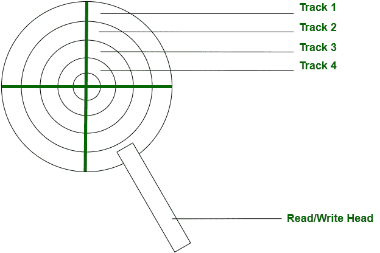

# 磁盘调度中寻道时间和磁盘访问时间的差异

> 原文:[https://www . geesforgeks . org/寻道时间和磁盘访问时间的差异磁盘调度/](https://www.geeksforgeeks.org/difference-between-seek-time-and-disk-access-time-in-disk-scheduling/)

**寻道时间:**
一个[圆盘](https://www.geeksforgeeks.org/hard-disk-drive-hdd-secondary-memory/)被分成许多圆形轨迹。寻道时间定义为读/写磁头从一个磁道移动到另一个磁道所需的时间。

例如，
考虑下图，读/写磁头当前在磁道 1 上。



现在，在下一个读/写请求中，我们可能希望从磁道 4 读取数据，在这种情况下，我们的读/写磁头将移动到磁道 4。到达轨道 4 所需的时间是**寻道时间**。


**磁盘访问时间:**
磁盘访问时间定义为计算机处理读/写请求，然后从磁盘存储器中检索所需数据所需的总时间。

磁盘访问时间分为两部分:

1.  存取时间
2.  数据传输时间

```
Disk Access Time = Access Time + Data Transfer Time 
```

**1。访问时间:**
访问时间定义为实际数据传输发生之前的设置时间。
例如，读/写磁头在磁道 1 上，但我们需要从另一个磁道或段读取数据。因此，在实际传输发生之前，读/写头将移动到数据块位置。这种延迟称为访问时间。

访问时间通过以下各项的总和来计算:

```
(a). Seek Time
(b). Rotational Latency
(c). Command Processing Time
(d). Settle Time 
```

下面简单解释一下。

*   **(一)。寻道时间–**
    是读/写磁头从当前磁道移动到请求磁道所需的时间。

    ```
    Seek Time 
    = (Number of tracks/cylinders crossed) * (Time to cross one track/cylinder) 
    ```

*   **(b)。旋转延迟–**
    是读/写磁头从当前扇区移动到请求扇区所需的时间。

```
Rotational Latency 
= (Angle by which disk is rotated) / (Angular Frequency) 
```

*   **(c)。命令处理时间–**
    是磁盘设备处理命令并在磁盘设备的各个组件之间建立读/写数据的连接所需的时间。这是由于内部电路。*   **(d). Settle Time –**
    Settle Time is the time required by read/write head to stop vibrating.

    **注:**数值问题中一般不提及命令处理时间和建立时间。我们把它们当成零。

    **2。数据传输时间:**
    数据传输时间定义为在系统和磁盘之间传输数据所需的时间。
    数据传输时间有两种类型:

    ```
    (a). Internal Transfer Rate
    (b). External Transfer Rate 
    ```

    下面简单解释一下。

    *   **(一)。内部传输速率–**
        它被定义为在磁盘表面和硬盘缓存之间移动数据所需的时间。
    *   **(b)。外部传输速率–**
        它被定义为在硬盘缓存和系统之间移动数据所需的时间。

    让我们看看寻道时间和磁盘访问时间之间的区别:

    | 没有 | 寻道时间 | 磁盘访问时间 |
    | --- | --- | --- |
    | one | 它是读/写磁头从一个磁道移动到另一个磁道所需的时间。 | 它是计算机处理读/写请求和检索所需数据所需的时间。 |
    | Two | 它总是小于磁盘访问时间。因为，它是磁盘访问时间的子部分。 | 与寻道时间相比，它非常大。 |
    | three | 它不考虑数据传输。 |

    It considers the time required to transfer data.c