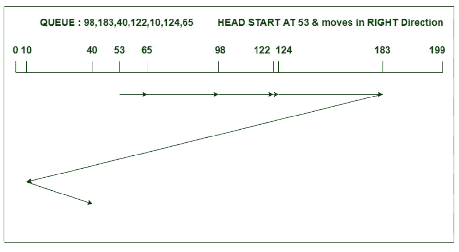

# SSTF 和 C-LOOK 磁盘调度算法的区别

> 原文:[https://www . geesforgeks . org/difference-sstf-and-c-look-disk-scheduling-algorithm/](https://www.geeksforgeeks.org/difference-between-sstf-and-c-look-disk-scheduling-algorithm/)

**1。 [SSTF 磁盘调度算法](https://www.geeksforgeeks.org/program-for-sstf-disk-scheduling-algorithm/) :**
SSTF 代表最短寻道时间优先。如名称所指定的，该算法服务于最接近头部或指针的当前位置的任务请求。这里，头部的方向在决定整个头部运动中起着至关重要的作用。如果两个请求之间出现联系，那么负责人将按照正在进行的方向处理遇到的请求。与 C-LOOK 不同，SSTF 算法在总寻道时间上非常高效。

**示例–**
考虑一个具有 200 个磁道(0-199 个)的磁盘，该磁盘队列具有如下顺序的输入/输出请求:

```
98, 183, 40, 122, 10, 124, 65
```

读/写磁头的当前磁头位置是 53，并将向右移动。使用 SSTF 算法计算读/写磁头的磁道移动总数。


头部运动总数，

```
= (65-53)+(65-40)+(40-10)+(98-10)+(122-98)+(124-122)+(183-124)
= 240
```

**2。 [C-LOOK 磁盘调度算法](https://www.geeksforgeeks.org/c-look-disk-scheduling-algorithm/) :**
C-LOOK 是 [LOOK 和](https://www.geeksforgeeks.org/difference-between-scan-and-look-disk-scheduling-algorithms/)扫描算法的修改版本。在该算法中，头部从一个方向的第一个请求开始，向另一端的最后一个请求移动，服务于其间的所有请求。在一端到达最后一个请求后，头部向另一个方向跳跃，并向剩余的请求移动，然后以与之前相同的方向满足它们。与 SSTF 不同，它不服务于最接近头部或指针当前位置的任务请求。

**示例–**
考虑一个具有 200 个磁道(0-199 个)的磁盘，该磁盘队列具有如下顺序的输入/输出请求:

```
98, 183, 40, 122, 10, 124, 65
```

读/写磁头的当前磁头位置是 53，并将向右移动。使用 C-LOOK 算法计算读/写磁头的磁道移动总数。



头部运动总数，

```
= (65-53)+(98-65)+(122-98)
   +(124-122)+(183-124)+(183-10)+(40-10)
= 333
```

**SSTF 和 C-LOOK 磁盘调度算法的区别:**

<center>

| 没有。 | SSTF 磁盘调度算法 | 查找磁盘调度算法 |
| one | SSTF 算法可以双向操纵请求。 | 而 C-LOOK 算法只在一个方向上服务请求。 |
| Two | 在 SSTF 算法中，找到最近的请求是一个负担。 | 这里，与 SSTF 相比，该算法导致更多的寻道时间。 |
| three | SSTF 算法性能滞后。 | 但是，C-LOOK 的表现远远好于 SSTF。 |
| four | 在上述 SSTF 算法的例子中，头部从 53 开始，分析最接近它的请求，并因此向那个方向移动。 | 在 C-LOOK 算法的上述例子中，头部从 53 开始移动，以正确的方向服务所有请求，直到它到达一端的最后一个请求。然后，它跳转到剩余的请求，只向正确的方向提供服务。 |
| five | SSTF 算法会导致饥饿。 | C-LOOK 算法永远不会导致任何请求饥饿。 |
| six | SSTF 在平均等待时间和响应时间方面差异很大。 | 而 C-LOOK 算法在平均等待时间和响应时间上的方差较低。 |

</center>