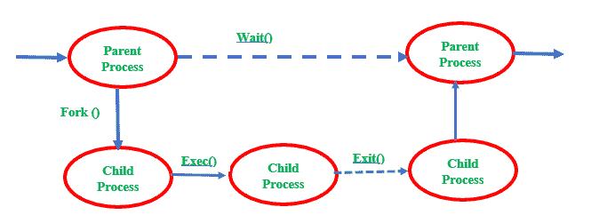

# 僵尸、孤儿和守护进程的区别

> 原文:[https://www . geesforgeks . org/僵尸孤儿和守护进程之间的区别/](https://www.geeksforgeeks.org/difference-between-zombie-orphan-and-daemon-processes/)

**1。僵尸进程:**
僵尸是一个已经完成任务的进程，但它仍然在进程表中显示一个条目。僵尸进程通常发生在子进程中。很短的时间这个过程就是僵尸。进程完成所有任务后，它会报告将要终止的父进程。

**僵尸进程状态**

僵尸无法自行终止，因为它被视为死进程。所以父进程需要执行终止命令来终止子进程

**2。孤儿进程:**
即使在父进程终止或完成后，子进程仍保持运行，无需等待子进程执行，这种进程称为孤儿进程。一个过程无意中变成了孤儿。由于长时间运行以完成分配的任务而不引起用户注意，有些时间故意成为孤儿。孤立进程有控制终端。

**3。守护进程:**
守护进程在系统引导时开始工作，仅在系统关闭时终止。它没有控制终端。它总是在后台运行。

**僵尸、孤儿和守护进程的区别:**

<figure class="table">

| 

Sl.No

 | 

僵尸进程

 | 

孤立进程

 | 

守护进程

 |
| --- | --- | --- | --- |
| 1. | 僵尸是一个已经完成任务的进程，但是它仍然在进程表中显示一个条目。 | 即使在父进程终止或完成后，子进程仍在运行，而不等待子进程执行，这种子进程称为孤立进程。 | 守护进程是始终在后台运行的系统相关进程。 |
| 2. | 僵尸进程状态总是用 Z 表示 | 由于系统崩溃，孤儿进程在不知情的情况下创建。 | 守护进程状态由？在输出中的 *tty* 列的字段中 |
| 3. | 僵尸进程有控制终端 | 孤儿僵尸进程有控制终端。 | 守护进程没有控制终端。 |
| 4. | 僵尸进程被视为死进程，它们不用于系统处理 | 孤立进程是一个计算机进程，即使在它们的父进程终止 init 成为父进程并继续剩余的任务之后。 | 长时间运行的程序使它们成为后台进程，并在后台运行。 |
| 5. | 要删除僵尸进程，请执行 kill 命令。 | 使用 SIGHUP 信号终止孤立进程。 | 守护进程仅在系统关闭时运行。 |

</figure>