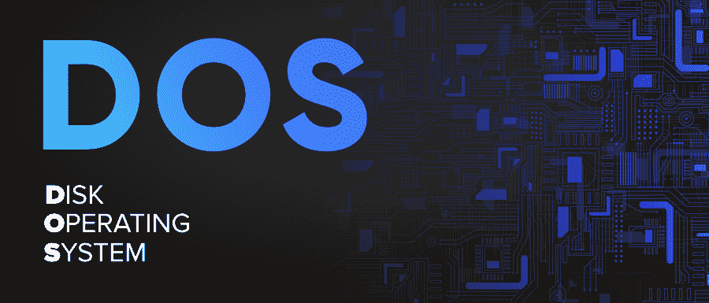

# DOS 全格式

> 原文:[https://www.geeksforgeeks.org/dos-full-form/](https://www.geeksforgeeks.org/dos-full-form/)

**DOS** 代表**磁盘操作系统**。
DOS 基本上指任何一种操作系统，但主要用于微软操作系统。DOS 提供了一个命令行，用户可以在其中以命令的形式给出指令。MS-DOS 在 20 世纪 80 年代和 90 年代初非常流行。它被认为是一个独立的操作系统。DOS 的早期版本功能简单，但后来的版本有了额外的功能。

#### 历史

DOS 于 1981 年 7 月 27 日获得微软许可。MS-DOS 的第一个正式版本于 1981 年 8 月发布，它是为 IBM 制造的。然后在接下来的几年里，新的更新版本推出了更多的功能和更好的工作。MS-DOS 6.22 是 1994 年 4 月发布的最后一个独立版本。此后，视窗 95 发布，被称为微软操作系统 7.0。

#### 特征

*   **高效的文件管理–**
    DOS 有助于高效的文件管理。文件的创建、编辑和删除等文件操作很容易。
*   **正确的环境–**
    它为用户提供了一个环境，用户可以在命令行上高效地进行输入、输出和给出命令。
*   **单用户操作系统–**
    在电脑上一次只能有一个用户。
*   **空间–**
    最大空间 2 GB。
*   **规格–**
    是 16 位操作系统。

#### 优势

*   DOS 中的命令易于记忆和使用。
*   DOS 是免费的，可以很容易地安装。
*   它让我们可以直接访问 BIOS 调用。
*   它可以在较小的机器上运行，因此引导过程比其他操作系统快得多。
*   DOS 非常轻量级，它允许访问硬件。
*   它没有多任务操作系统的开销。

#### 不足之处

*   DOS 不支持多任务处理。
*   它只有 2 GB 的空间，无法扩展。
*   它一次只能有一个用户。
*   它与其他浏览器不兼容。
*   它不支持联网。
*   操作系统不支持自动 IRQ 排序。
*   图形部门可没这么花哨。

**DOS 命令示例**

以下是 DOS 的一些基本命令–

*   **目录–**显示目录的内容。
*   **擦除**–删除文件。
*   **移动**–将文件移动到另一个目录。
*   **编辑**–启动文本编辑器。
*   **CLS**–清除屏幕。