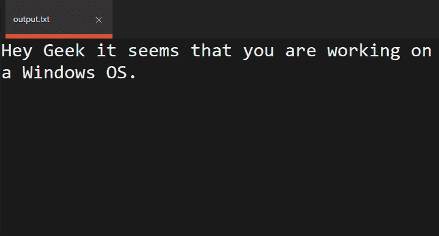

# 如何通过 C 程序检测操作系统

> 原文:[https://www . geesforgeks . org/如何通过 a-c-program 检测操作系统/](https://www.geeksforgeeks.org/how-to-detect-operating-system-through-a-c-program/)

借助 C 编程可以找出运行程序的操作系统。这条信息对于我们想要构建平台独立程序的情况非常有用。为了找到操作系统，我们检查了编译器定义的宏，例如，32 位操作系统的窗口有“ **_WIN32** ”作为宏，所以如果定义了宏，那么我们工作的系统就是 32 位操作系统的窗口。类似地，其他操作系统也有不同的宏定义。一些流行操作系统的宏列表如下:

<figure class="table">

| -你好。不，不。 | 操作系统 | 宏观存在 | 笔记 |
| --- | --- | --- | --- |
| 1. | Windows 32 位+ 64 位 | _WIN32 | 适用于所有视窗操作系统 |
| 2. | Windows 64 位 | _WIN64 | 仅适用于 64 位窗口 |
| 3. | 苹果 | __APPLE__ | 适用于所有苹果操作系统 |
| 4. | 苹果 | __MACH__ | 以上的替代方案 |
| 5. | iOS 嵌入式 | 目标操作系统嵌入式 | 包含 TargetConditionals.h |
| 6. | iOS 模拟器 | 目标 _ IPHONE _ 模拟器 | 包含 TargetConditionals.h |
| 7. | 苹果手机 | TARGET_OS_IPHONE | 包含 TargetConditionals.h |
| 8. | 苹果电脑 | 目标操作系统媒体访问控制 | 包含 TargetConditionals.h |
| 9. | 机器人 | __ANDROID__ | linux 的子集 |
| 10. | 基于 Unix 的操作系统 | __unix__ | – |
| 11. | Linux 操作系统 | __linux__ | unix 子集 |
| 12. | 基于 POSIX 的 | _POSIX_VERSION | 带有 Cygwin 的窗口 |
| 13. | Solaris | __sun | – |
| 14. | 惠普用户体验 | __hpux | – |
| 15. | 加州大学伯克利分校软件(Berkeley Software Distribution) | 加州大学伯克利分校软件(Berkeley Software Distribution) | 所有 BSD 口味 |
| 16. | 蜻蜓 BSD | __ 蜻蜓 _ _ | – |
| 17. | FreeBSD | __FreeBSD__ | – |
| 18. | NetBSD | _ _ _ _ _ _ _ _ _ | – |
| 19. | OpenBSD | __OpenBSD__ | – |

**注:**

> 必须注意的是[宏](https://www.geeksforgeeks.org/interesting-facts-preprocessors-c/)对于 GNU GCC 和 G++是有效的，对于其他编译器可能会有所不同。

以下是检测我们正在使用的操作系统的程序:

## C

```
// C program to detect Operating System

#include <stdio.h>

// Driver Code
int main()
{

// Checking for windows OS with
// _WIN32 macro
#ifdef _WIN32
    printf("Hey Geek it seems that"
           "you are working on a Windows OS.\n");

// Checking for mac OS with
// __APPLE__ macro
#elif __APPLE__
    printf("Hey Geek it seems that you"
           "are working on a Mac OS.\n");

// Checking for linux OS with
// __linux__ macro
#elif __linux__
    printf("Hey Geek it seems that you"
           "are working on a Linux OS.\n");

// Checking for iOS embedded OS with
// TARGET_OS_EMBEDDED macro
#elif TARGET_OS_EMBEDDED
    printf("Hey Geek it seems that you"
           "are working on an iOS embedded OS.\n");

// Checking for iOS simulator OS with
// TARGET_IPHONE_SIMULATOR macro
#elif TARGET_IPHONE_SIMULATOR
    printf("Hey Geek it seems that you"
           "are working on an iOS simulator OS.\n");

// Checking for iPhone OS with
// TARGET_OS_IPHONE macro
#elif TARGET_OS_IPHONE
    printf("Hey Geek it seems that you"
           "are working on an iPhone OS.\n");

// Checking for MAC OS with
// TARGET_OS_MAC macro
#elif TARGET_OS_MAC
    printf("Hey Geek it seems that you"
           "are working on a MAC OS.\n");

// Checking for Android OS with
// __ANDROID__ macro
#elif__ANDROID__
    printf("Hey Geek it seems that you"
           "are working on an android OS.\n");

// Checking for unix OS with
// __unix__ macro
#elif __unix__
    printf("Hey Geek it seems that you"
           "are working on a unix OS.\n");

// Checking for POSIX based OS with
// _POSIX_VERSION macro
#elif _POSIX_VERSION
    printf("Hey Geek it seems that you"
           "are working on a POSIX based OS.\n");

// Checking for Solaris OS with
// __sun macro
#elif __sun
    printf("Hey Geek it seems that you"
           "are working on a Solaris OS.\n");

// Checking for HP UX OS with
// __hpux macro
#elif __hpux
    printf("Hey Geek it seems that you"
           "are working on a HP UX OS.\n");

// Checking for BSD OS with
// BSD macro
#elif BSD
    printf("Hey Geek it seems that you"
           "are working on a Solaris OS.\n");

// Checking for DragonFly BSD OS with
// __DragonFly__ macro
#elif __DragonFly__
    printf("Hey Geek it seems that you"
           "are working on a DragonFly BSD OS.\n");

// Checking for FreeBSD OS with
// __FreeBSD__ macro
#elif __FreeBSD__
    printf("Hey Geek it seems that you"
           "are working on a FreeBSD OS.\n");

// Checking for Net BSD OS with
// __NetBSD__ macro
#elif __NetBSD__
    printf("Hey Geek it seems that you"
           "are working on a Net BSD OS.\n");

// Checking for Open BSD OS with
// __OpenBSD__ macro
#elif __OpenBSD__
    printf("Hey Geek it seems that you"
           "are working on an Open BSD OS.\n");

// If neither of them is present
// then this is printed...
#else
    printf("Sorry, the system are"
           "not listed above.\n");
#endif
    return 0;
}
```

**Output:**
Below is the output of the above program on a **Windows OS**:
[](https://media.geeksforgeeks.org/wp-content/cdn-uploads/20200715103245/WindowOSOutput.png)

类似地，人们可以找到操作系统，并可以 [<u>为系统设置适当的代码</u>](https://www.geeksforgeeks.org/writing-os-independent-code-cc/)

</figure>