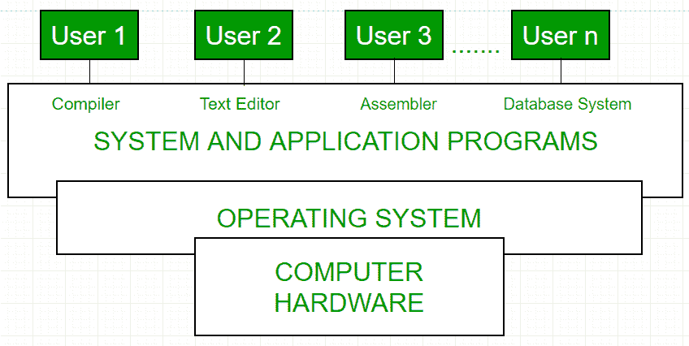

# 操作系统介绍–第 1 集

> 原文:[https://www . geesforgeks . org/操作系统介绍-set-1/](https://www.geeksforgeeks.org/introduction-of-operating-system-set-1/)

操作系统充当计算机用户和计算机硬件之间的中介。操作系统的目的是提供一个用户可以方便有效地执行程序的环境。

操作系统是管理计算机硬件的软件。硬件必须提供适当的机制来确保计算机系统的正确运行，并防止用户程序干扰系统的正常运行。

**操作系统–**定义:

*   操作系统是控制应用程序执行的程序，并充当计算机用户和计算机硬件之间的接口。
*   一个更常见的定义是，操作系统是在计算机上一直运行的一个程序(通常称为内核)，其他都是应用程序。
*   操作系统关注资源和服务的分配，如内存、处理器、设备和信息。操作系统相应地包括管理这些资源的程序，例如流量控制器、调度器、存储器管理模块、输入/输出程序和文件系统。

**操作系统的功能–**操作系统执行三种功能:

1.  **便利性:**一个 OS 让电脑使用起来更加方便。
2.  **效率:**操作系统允许计算机系统资源得到有效利用。
3.  **进化能力:**操作系统的构建方式应允许在不干扰服务的情况下，同时有效开发、测试和引入新的系统功能。
4.  **吞吐量:**应该构建一个操作系统，使其能够给出最大的**吞吐量**(单位时间的任务数)。

**操作系统的主要功能:**

*   **资源管理:**当操作系统中发生并行访问时，意味着当多个用户访问系统时，操作系统作为资源管理器工作，其职责是向用户提供硬件。它减少了系统中的负载。
*   **流程管理:**包括流程的**调度**、**终止**等各种任务。操作系统一次管理各种任务。这里 **CPU 调度**的发生意味着所有的任务都将由许多用于调度的算法来完成。
*   **存储管理:****文件系统**机制用于管理存储。**NIFS****CFS****CIFS****NFS**等。是一些文件系统。所有数据都存储在硬盘的不同磁道上，这些磁道都由存储管理器管理。它包括**硬盘**。
*   **内存管理:**指主内存的管理。操作系统必须跟踪，使用了多少内存，由谁使用。它必须决定哪个进程需要内存空间以及需要多少。操作系统还必须分配和释放内存空间。
*   **安全/隐私管理:**隐私也是由操作系统通过密码的方式提供的，这样未经授权的应用程序就无法访问程序或数据。例如，Windows 使用 **Kerberos** 身份验证来防止未经授权的数据访问。

作为用户界面的过程操作系统:

1.  用户
2.  系统和应用程序
3.  操作系统
4.  五金器具

每台通用计算机都由硬件、操作系统、系统程序和应用程序组成。硬件由内存、中央处理器、算术逻辑单元、输入/输出设备、外围设备和存储设备组成。系统程序由编译器、加载器、编辑器、操作系统等组成。应用程序由业务程序、数据库程序组成。

图 1:计算机系统的概念图

每台计算机都必须有一个操作系统来运行其他程序。操作系统协调各种用户的各种系统程序和应用程序之间的硬件使用。它只是提供了一个环境，其他程序可以在其中做有用的工作。

操作系统是运行在计算机系统上的一组特殊程序，允许它正常工作。它执行基本任务，如识别键盘输入、跟踪磁盘上的文件和目录、向显示屏发送输出以及控制外围设备。
操作系统设计用于两个基本目的:

1.  它控制计算系统资源在不同用户和任务之间的分配和使用。
2.  它提供了计算机硬件和程序员之间的接口，简化了应用程序的编码、创建和调试，并使其变得可行。

操作系统必须支持以下任务。任务是:

1.  提供使用编辑器创建、修改程序和数据文件的工具。
2.  访问编译器，将用户程序从高级语言翻译成机器语言。
3.  提供一个加载程序，将编译后的程序代码移动到计算机内存中执行。
4.  提供处理输入输出编程细节的例程。

**输入/输出系统管理–**
跟踪设备状态的模块称为输入/输出流量控制器。每个输入/输出设备都有一个设备处理程序，驻留在与该设备相关联的单独进程中。
输入输出子系统由
组成

*   一个内存管理组件，包括缓冲缓存和假脱机。
*   通用设备驱动程序接口。

特定硬件设备的驱动程序。

**汇编程序–**
汇编程序的输入是汇编语言程序。输出是一个目标程序加上信息，使加载程序准备执行目标程序。曾经，计算机程序员拥有一台基本机器，可以通过硬件解释某些基本指令。他会通过编写一系列 1 和 0(机器语言)来给这台计算机编程，并将它们放入机器的内存中。

**编译器–**
高级语言——例如 FORTRAN、COBOL、ALGOL 和 PL/I 都是由编译器和解释器处理的。编译器是接受“高级语言”源程序并产生相应目标程序的程序。解释器是一个程序，它看起来像机器语言一样执行一个源程序。同名(FORTRAN、COBOL 等。)通常用于表示编译器及其相关语言。

**Loader–**
Loader 是加载目标程序并准备执行的例程。有各种加载方案:绝对、重定位和直接链接。通常，加载程序必须加载、重定位和链接目标程序。加载程序是一个将程序放入内存并准备执行的程序。在一个简单的加载方案中，汇编器将程序的机器语言翻译输出到辅助设备上，加载器将它放在内核中。加载程序将用户程序的机器语言版本放入内存，并将控制权转移给它。由于加载程序比汇编程序小得多，因此用户程序可以使用更多的内核。

**操作系统的历史–**
操作系统多年来一直在进化。下表显示了操作系统的历史。

<figure class="table">

| 产生 | 年 | 使用的电子设备 | 操作系统设备的类型 |
| 第一 | 1945-55 | 真空管 | 插板 |
| 第二 | 1955-65 | 晶体管 | 批处理系统 |
| 第三 | 1965-80 | 集成电路 | 多道程序设计 |
| 第四 | 自 1980 年以来 | 大规模集成 | 个人电脑 |

[**操作系统类型**](https://www.geeksforgeeks.org/operating-system-types-operating-systems-awaiting-author/)**–**

*   批处理操作系统——计算机程序中没有人工干预的作业序列。
*   分时操作系统——允许许多用户共享计算机资源。(资源的最大利用率)。
*   分布式操作系统-管理一组不同的计算机，使其看起来像一台计算机。
*   网络操作系统-运行在不同操作系统中的计算机可以参与一个公共网络(它用于安全目的)。
*   实时操作系统——意味着应用程序要固定期限。

操作系统的例子有–

*   视窗(基于图形用户界面，个人电脑)
*   个人、工作站、互联网服务提供商、文件和打印服务器、三层客户机/服务器
*   macOS (Macintosh)，用于苹果的个人电脑和工作站(MacBook、iMac)。
*   安卓(谷歌智能手机/平板电脑/智能手表操作系统)
*   iOS(苹果用于 iPhone、iPad 和 iPod Touch 的操作系统)

**参考资料–**
[操作系统概念–书籍](https://www.amazon.in/Operating-System-Concepts-International-Student/dp/8126520515?tag=googinhydr18418-21&tag=googinkenshoo-21&ascsubtag=f648c41b-4e1c-497e-9a52-031912e87d54)
[操作系统介绍–NPTEL](http://nptel.ac.in/courses/106108101/)

</figure>