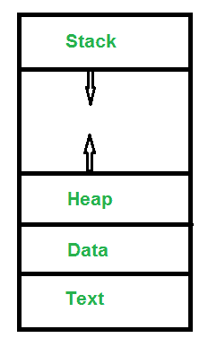
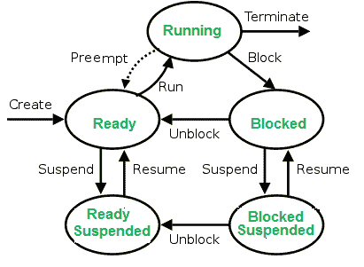

# 流程管理介绍

> 原文:[https://www . geesforgeks . org/流程管理简介/](https://www.geeksforgeeks.org/introduction-of-process-management/)

**程序 vs 过程**
过程是正在执行的程序。例如，当我们用 C 或 C++编写程序并编译它时，编译器会创建二进制代码。原始代码和二进制代码都是程序。当我们实际运行二进制代码时，它就变成了一个过程。

一个进程是一个“主动”实体，而不是一个被认为是“被动”实体的程序。一个程序运行多次可以创建多个进程；例如，当我们多次打开. exe 或二进制文件时，会开始多个实例(创建多个进程)。

**记忆中的过程是什么样子的？**



***文本部分** :* 流程，有时也称为文本部分，也包括由 ***程序计数器*** 的值表示的当前活动。
***堆栈** :* 堆栈包含临时数据，如函数参数、返回地址和局部变量。
***数据段** :* 包含全局变量。
***堆部分** :* 在运行时动态分配内存给进程。
详见[本](https://www.geeksforgeeks.org/memory-layout-of-c-program/)章节。

**流程的属性或特征**
流程具有以下属性。
分区块

```
1\. Process Id:    A unique identifier assigned by the operating system
2\. Process State: Can be ready, running, etc.
3\. CPU registers: Like the Program Counter (CPU registers must be saved and 
                  restored when a process is swapped in and out of CPU)
5\. Accounts information:
6\. I/O status information: For example, devices allocated to the process, 
                           open files, etc
8\. CPU scheduling information: For example, Priority (Different processes 
                               may have different priorities, for example
                               a shorter process assigned high priority
                               in the shortest job first scheduling)
```

流程的所有上述属性也被称为流程的**上下文。
每道工序都有自己的[工序控制块](http://en.wikipedia.org/wiki/Process_control_block) (PCB)，即每道工序都有一个唯一的 PCB。上述所有属性都是印刷电路板的一部分。**

****进程状态:**
进程处于以下状态之一:** 

```
**1\. New:** Newly Created Process (or) being-created process.

**2\. Ready:** After creation process moves to Ready state, i.e. the 
          process is ready for execution.

**3\. Run:** Currently running process in CPU (only one process at
        a time can be under execution in a single processor).

**4\. Wait (or Block):** When a process requests I/O access.

**5\. Complete (or Terminated):** The process completed its execution.

**6\. Suspended Ready:** When the ready queue becomes full, some processes 
                    are moved to suspended ready state

**7\. Suspended Block:** When waiting queue becomes full.
```

****

****上下文切换**
保存一个进程的上下文并加载另一个进程的上下文的过程称为上下文切换。简单来说，就像从运行状态到就绪状态加载和卸载流程。**

****语境切换什么时候发生？**
1。当高优先级进程进入就绪状态(即优先级高于正在运行的进程)时
2。出现中断
3。用户和内核模式切换(虽然不是必须的)
4。使用了抢占式 CPU 调度。**

****上下文切换 vs 模式切换**
当中央处理器特权级别改变时，例如系统调用或故障发生时，会发生模式切换。内核工作在特权模式，而不是标准的用户任务。如果一个用户进程想要访问只有内核可以访问的东西，就必须进行模式切换。在模式切换期间，不需要改变当前正在执行的进程。
模式切换通常发生在过程上下文切换发生时。只有内核可以导致上下文切换。**

****受 CPU 限制的进程与受 I/O 限制的进程:**
受 CPU 限制的进程需要更多的 CPU 时间，或者在运行状态下花费更多的时间。
一个 I/O 绑定的进程需要更多的 I/O 时间和更少的 CPU 时间。受输入/输出限制的进程在等待状态下花费更多的时间。**

****锻炼:**
**1。**以下哪项不一定需要保存在进程间的上下文切换中？(GATE-CS-2000)
(A)通用寄存器
(B)翻译后备缓冲器
(C)程序计数器
(D)以上全部**

****回答(B)****

****解释:**
在进程上下文切换中，第一个进程的状态必须以某种方式保存，这样当调度器回到第一个进程的执行时，它就可以恢复这个状态并继续。进程的状态包括进程可能正在使用的所有寄存器，尤其是程序计数器，以及可能需要的任何其他特定于操作系统的数据。转换后备缓冲区(TLB)是一个中央处理器高速缓存，内存管理硬件使用它来提高虚拟地址转换速度。TLB 有固定数量的包含页表条目的插槽，页表条目将虚拟地址映射到物理地址。在上下文切换时，由于虚拟到物理的映射不同，一些 TLB 条目可能会变得无效。处理这个问题最简单的策略就是彻底冲洗 TLB。**

****2。**在用户和内核执行模式之间切换所花费的时间是 T1，而在两个进程之间切换所花费的时间是 t2。以下哪一项是正确的？(GATE-CS-2011)
(A)t1>T2
(B)t1 = T2
(C)t1<T2
(D)t1 和 T2 的关系没什么好说的。**

****回答:(C)**
**说明:**流程切换涉及一个模式切换。上下文切换只能在内核模式下发生。**

**[流程管理小测验](https://www.geeksforgeeks.org/operating-systems-gq/process-synchronization-gq/)**

****参考文献:**
[http://www . cs . UIC . edu/~ jbell/course notes/operating systems/3 _ processes . html](http://www.cs.uic.edu/~jbell/CourseNotes/OperatingSystems/3_Processes.html)
[http://cs . NYU . edu/courses/spring 11/g 22.2250-001/讲座/讲座-04.html](http://cs.nyu.edu/courses/spring11/G22.2250-001/lectures/lecture-04.html)**

**如果发现有不正确的地方，请写评论，或者想分享更多关于以上讨论话题的信息**