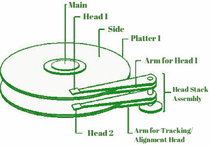

# 辅助存储器介绍

> 原文:[https://www . geesforgeks . org/二级内存介绍/](https://www.geeksforgeeks.org/introduction-of-secondary-memory/)

主内存的存储容量有限，并且易失性。辅助存储器通过提供数据的永久存储和批量存储克服了这一限制。辅助存储器也称为外部存储器，指的是计算机可以存储数据和程序的各种存储介质。辅助存储介质可以是固定的或可移动的。固定存储介质是像硬盘一样固定在计算机内部的内部存储介质。便携式且可从计算机外部取出的存储介质称为可移动存储介质。

**主记忆和次记忆的区别:**

<figure class="table">

| 主存储器 | 辅助存贮器 |
| --- | --- |
| 主存储器由中央处理器直接访问。 | 中央处理器不直接访问辅助存储器。相反，从辅助存储器访问的数据首先被加载到随机存取存储器中，然后被发送到处理单元。 |
| 内存提供了比二级内存更快的数据存取速度。通过将软件程序和所需文件加载到主内存中，计算机可以更快地处理数据。 | 辅助内存的数据访问速度较慢。通常，主内存比辅助内存快六倍。 |
| 主存储器，即随机存取存储器(RAM)是易失性的，当计算机关闭时会被完全擦除。 | 辅助存储器具有非易失性的特点，这意味着它可以在有或没有电源的情况下保存数据。 |

**辅助媒体的使用:**

*   **永久存储:**主存储器(RAM)是易失性的，即断电时会丢失所有信息，因此为了将数据永久保存在设备中，需要辅助存储设备。
*   **便携性:**像光盘、闪存驱动器这样的存储介质可以用来将数据从一台设备传输到另一台设备。

**固定和可移动存储器**

**固定存储-**
固定存储是计算机系统用来存储数据的内部媒体设备，通常被称为固定磁盘驱动器或硬盘驱动器。
固定存储设备从字面上看并不固定，显然，这些可以从系统中移除，用于维修工作、维护目的，也用于升级等。但总的来说，没有合适的工具包来打开计算机系统以提供物理访问，这是不可能做到的，这需要由工程师来完成。
从技术上讲，几乎所有在计算机系统上处理的数据都存储在某种类型的内置固定存储设备上。

**固定存储类型:**

*   内部闪存(罕见)
*   固态硬盘单元
*   硬盘驱动器

**可移动存储-**
可移动存储是计算机系统用来存储数据的外部媒体设备，通常被称为可移动磁盘驱动器或外部驱动器。
可移动存储是任何类型的存储设备，可以在系统运行时从计算机系统中移除/弹出。外部设备的例子包括光盘、DVD 和蓝光光盘驱动器，以及软盘和 USB 驱动器。可移动存储使用户更容易将数据从一个计算机系统传输到另一个计算机系统。
在存储因素方面，可移动磁盘的主要优势在于它们可以提供与存储区域网络(SANs)相关的快速数据传输速率

**可移动存储的类型:**

*   光盘(光盘、数字视盘、蓝光光盘)
*   存储卡
*   软盘
*   磁带
*   磁盘包
*   纸张存储(穿孔带、穿孔卡片)

**二级存储介质**

存储介质主要有以下几种类型:

**1。磁性存储介质:**
磁性介质上涂有一层顺时针或逆时针方向磁化的磁性层。当磁盘移动时，磁头在读取时以二进制 1 和 0 解释存储在特定位置的数据。

**示例:**硬盘、软盘和磁带。

*   **软盘:**软盘是上面有磁性涂层的软盘。它被包装在一个保护性的塑料信封里。这些是最古老的便携式存储设备之一，最多可存储 1.44 兆字节的数据，但现在由于内存存储非常少而没有使用。
*   **Hard disk:** A hard disk consists of one or more circular disks called platters which are mounted on a common spindle. Each surface of a platter is coated with magnetic material. Both surfaces of each disk are capable of storing data except the top and bottom disks where only the inner surface is used. The information is recorded on the surface of the rotating disk by magnetic read/write heads. These heads are joined to a common arm known as the access arm. 

    **硬盘驱动器组件:**
    大多数基本类型的硬盘驱动器都包含许多磁盘盘片，这些磁盘盘片被放置在一个主轴周围，该主轴被放置在一个密封的腔室内。该室还包括读/写头和马达。数据以同心圆的排列方式存储在这些磁盘中的每一个磁盘上，同心圆被称为磁道，磁道又被进一步分成扇区。虽然内置硬盘不是很便携，并且在计算机系统内部使用，但外置硬盘可以替代便携存储。硬盘可以存储高达几兆字节的数据。

**2。光存储介质**
在光存储中，介质信息是用激光束存储和读取的。数据被存储为表示二进制 0 和二进制 1 的凹坑和脊的螺旋图案。
示例:光盘和 DVD

*   **光盘:**光盘驱动器(CDD)是计算机用来读取光盘(CD)上数字编码数据的设备。光盘驱动器可以安装在计算机的隔间内，提供一个开口，以便更容易地访问光盘托盘，或者它可以由连接到计算机系统中提供的一个端口的外围设备使用。一张光盘可以存储大约 650 到 700 兆字节的数据。电脑应该有一个光驱来读取光盘。光盘有三种类型:

<figure class="table">

| cd-rom | 可刻录光盘 | CD-RW |
| --- | --- | --- |
| 它代表光盘只读存储器 | 它代表可刻录光盘。 | 它代表可重写光盘。 |
| 数据在制造时被写入这些磁盘。这个数据一旦被厂家写入就不能更改，只能读取。光盘用于文本、音频和视频分发，如游戏、百科全书和应用软件。 | 数据可以记录在这些磁盘上，但只能记录一次。一旦数据被写入光盘，就不能被擦除/修改。 | 它可以多次读取或写入，但在编辑光盘之前，需要在您的计算机上安装光盘驱动器。 |

</figure>

*   **DVD:**
    代表数字多功能盘或数字视盘。它看起来就像一张光盘，使用与光盘相似的技术，但允许轨道间隔足够近，以存储超过光盘容量六倍的数据。这是便携式存储技术的重大进步。一张 DVD 可以容纳 4.7 到 17 GB 的数据。
*   **蓝光光盘:**
    这是最新的存储高清音视频的光存储介质。它类似于 CD 或 DVD，但在单层磁盘上最多可存储 27 GB 数据，在双层磁盘上最多可存储 54 GB 数据。当光盘或 DVD 使用红色激光束时，蓝光光盘使用蓝色激光在光盘上读/写数据。

**3。固态存储器**
固态存储设备基于电子电路，没有像磁带卷轴、旋转磁盘等移动部件。固态存储设备使用称为闪存的特殊存储器来存储数据。固态硬盘(或闪存)主要用于数码相机、笔式硬盘或 u 盘。

**笔式驱动器:**
笔式驱动器或拇指驱动器或闪存驱动器是最近出现的便携式存储介质。它是一种基于 EEPROM 的闪存，可以使用电信号反复擦除和写入。该内存配有一个通用串行总线连接器，使笔驱动器能够连接到计算机。它们的容量比硬盘小，但比光盘大。Pendrive 具有以下优势:

*   **传输文件:**
    将笔式驱动器插入系统的 USB 端口，可用作将文件、文档和照片传输到 PC 的设备，反之亦然。同样，选定的文件可以在笔式驱动器和任何类型的工作站之间传输。
*   **便携性:**
    笔式驱动器的轻质特性和较小的尺寸使其能够从一个地方携带到另一个地方，这使得数据传输变得更加容易。
*   **备份存储:**
    现在大多数笔式硬盘都具备密码加密功能，与家庭、病历和照片相关的重要信息都可以作为备份存储在上面。
*   **传输数据:**
    专业人士/学生现在可以在笔式硬盘上轻松传输大型数据文件和视频/音频讲座，并从任何地方访问它们。独立的电脑技术人员可以将与工作相关的实用工具、各种程序和文件存储在 64 GB 的高速笔式驱动器上，并从一个站点移动到另一个站点。

</figure>