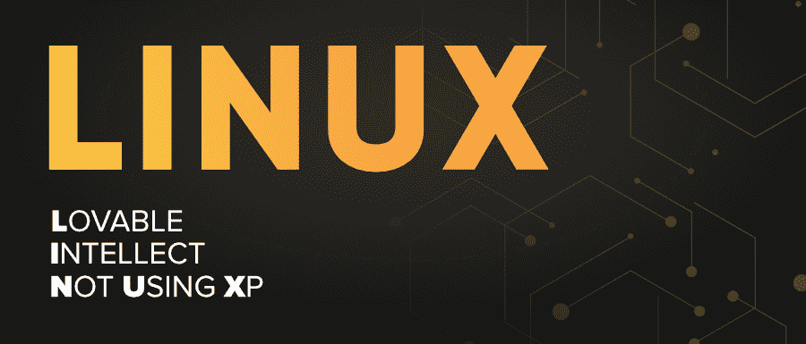

# LINUX 完整版

> 原文:[https://www.geeksforgeeks.org/linux-full-form/](https://www.geeksforgeeks.org/linux-full-form/)

**LINUX** 代表**不使用 XP** 的可爱智慧。Linux 是由 Linus Torvalds 开发的，并以他的名字命名。Linux 是一个面向计算机、服务器、大型机、移动设备和嵌入式设备的开源和社区开发的操作系统。Linux 接收来自系统程序的请求，并将它们转发到计算机硬件中。Linux 灵活、可靠、安全，得到了大量社区用户的支持。Linux 几乎兼容所有可能的文件格式，可以在大量设备上运行。

Linux 是一个多编程、多用户的操作系统，它意味着同一系统可以被具有不同访问权限的不同用户使用，同时许多应用程序可以在其上运行。

#### Linux 的特点

*   Linux 可以在不同类型的硬件上工作，所以 Linux 是可移植的。
*   Linux 是开源的，所以可以免费使用，用户也可以致力于增强 Linux 操作系统的功能。
*   它是多用户操作系统，这意味着多个用户可以访问该系统。
*   Linux 是安全，因为它提供了密码保护和数据加密。
*   Linux 是多程序设计的，因为多个应用程序可以同时运行。

#### Linux 的优势

*   Linux 兼容大量文件格式。
*   Linux 是免费的，所以用户很容易下载和使用。
*   随着用户可以在 Linux 操作系统中进行更改，它日益增强。
*   Linux 系统很少崩溃，因为它们非常稳定。
*   Linux 没有收集太多的用户数据，所以它保证了用户的隐私。

#### Linux 的缺点

*   Linux 没有提供一些硬件驱动，这是 Linux 的缺点。
*   对于初学者来说，Linux 的命令行界面很难使用。
*   有些图形工具不适用于 Linux 操作系统。
*   Linux 没有标准版本，这使得用户很难根据自己的需求选择最佳版本。