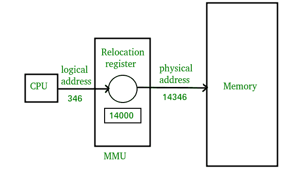

# 操作系统中的逻辑和物理地址

> 原文:[https://www . geesforgeks . org/操作系统中的逻辑和物理地址/](https://www.geeksforgeeks.org/logical-and-physical-address-in-operating-system/)

**逻辑地址**是程序运行时由中央处理器生成的。逻辑地址是虚拟地址，因为它在物理上不存在，因此，它也被称为虚拟地址。该地址用作中央处理器访问物理内存位置的参考。术语“逻辑地址空间”用于由程序视角生成的所有逻辑地址的集合。
称为内存管理单元的硬件设备用于将逻辑地址映射到其对应的物理地址。

**物理地址**标识存储器中所需数据的物理位置。用户从不直接处理物理地址，但可以通过其对应的逻辑地址进行访问。用户程序生成逻辑地址，认为程序在这个逻辑地址上运行，但程序的执行需要物理内存，因此，逻辑地址在使用前必须由 MMU 映射到物理地址。术语“物理地址空间”用于与逻辑地址空间中的逻辑地址相对应的所有物理地址。

[将虚拟地址映射到物理地址](https://www.geeksforgeeks.org/memory-management-mapping-virtual-address-physical-addresses/)
**操作系统中逻辑和物理地址的差异**

1.  逻辑地址和物理地址的基本区别在于，从程序的角度来看，逻辑地址是由中央处理器生成的，而物理地址是内存单元中存在的一个位置。
2.  逻辑地址空间是中央处理器为程序生成的所有逻辑地址的集合，而映射到相应逻辑地址的所有物理地址的集合称为物理地址空间。
3.  逻辑地址在物理上不存在于存储器中，而物理地址是存储器中可以被物理访问的位置。
4.  相同的逻辑地址由编译时和加载时地址绑定方法生成，而它们在运行时地址绑定方法上彼此不同。详见[本](https://www.geeksforgeeks.org/memory-management-mapping-virtual-address-physical-addresses/)。
5.  逻辑地址由中央处理器在程序运行时生成，而物理地址由内存管理单元计算。

**对比图:**

<figure class="table">

| 参数 | 逻辑地址 | 物理地址 |
| --- | --- | --- |
| 基础 | 由中央处理器产生 | 存储单元中的位置 |
| 地址空间 | 逻辑地址空间是由中央处理器参照程序生成的所有逻辑地址的集合。 | 物理地址是映射到相应逻辑地址的所有物理地址的集合。 |
| 能见度 | 用户可以查看程序的逻辑地址。 | 用户永远无法查看程序的物理地址。 |
| 产生 | 由中央处理器产生 | 由内存管理单元计算 |
| 接近 | 用户可以使用逻辑地址来访问物理地址。 | 用户可以间接访问物理地址，但不能直接访问。 |

</figure>