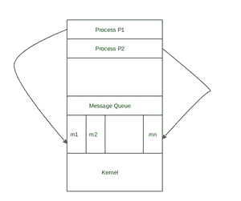

# 流程沟通的消息传递模型

> 原文:[https://www . geesforgeks . org/message-passing-model-of-process-communication/](https://www.geeksforgeeks.org/message-passing-model-of-process-communication/)

所以消息传递意味着消息如何从一端发送到另一端。它可能是客户机-服务器模型，也可能是从一个节点到另一个节点。分布式消息传递的形式模型有两种定时模型，一种是同步的，另一种是异步的。

**消息传递的基本点是:**

1.  在消息传递系统中，处理器通过在通信信道上发送和接收消息来相互通信。那么应该如何安排呢？
2.  通道提供的连接模式由一些拓扑系统描述。
3.  这些通道的集合称为网络。
4.  所以根据分布式系统的定义，我们知道它们是地理上的计算机集合。因此，一台计算机不可能直接与其他节点连接。
5.  因此，消息传递模型中的所有通道都是私有的。
6.  发送方决定哪些数据必须通过网络发送。一个例子是，打电话。
7.  只有在目的地工作人员决定接收数据后，数据才会完全通信。例如，当另一个人接到你的电话并开始回复你时。
8.  没有时间障碍。它在听筒里，在他接到你的电话多少次之后。他不接电话会让你永远等下去。
9.  成功的网络传播，需要双方的积极参与。

消息传递模型

**算法:**

1.  让我们考虑一个由 n 个名为 p 0、 p 1、 p 2 的节点组成的网络……..p n-1 为双向点对点通道。
2.  每个节点可能不知道谁在另一端。这样，拓扑就会被安排好。
3.  无论何时建立通信，无论何时开始消息传递，只有进程知道消息必须从哪里发送到哪里。

**消息传递模型的优势:**

1.  更容易实现。
2.  非常能容忍高通信延迟。
3.  更容易构建大规模并行硬件。
4.  它更能容忍更高的通信延迟。
5.  消息传递库速度更快，性能更高。

**消息传递模型的缺点:**

1.  程序员什么都要做。
2.  连接建立需要时间，这就是为什么它比较慢。
3.  数据传输通常需要合作操作，这很难实现。
4.  程序员很难使用这种模型开发可移植的应用程序，因为消息传递实现通常包含嵌入源代码的子程序库。在这里，程序员必须自己做所有的事情。