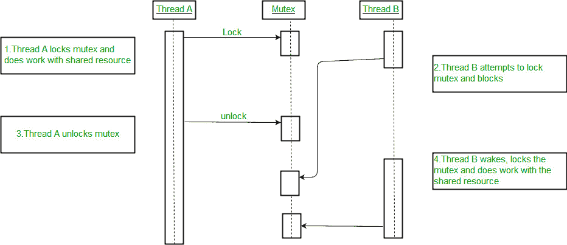

# 【Linux 线程同步的互斥锁

> 原文:[https://www . geesforgeks . org/mutex-lock-for-Linux-thread-synchronization/](https://www.geeksforgeeks.org/mutex-lock-for-linux-thread-synchronization/)

**先决条件:**[C 中多线程](https://www.geeksforgeeks.org/multithreading-c-2/)

**线程同步**被定义为确保两个或多个并发进程或线程不会同时执行某个特定程序段(称为临界区)的机制。进程对关键部分的访问通过使用同步技术来控制。当一个线程开始执行[关键部分](https://www.geeksforgeeks.org/g-fact-70/)(程序的一个序列化段)时，另一个线程应该等到第一个线程完成。如果没有应用适当的同步技术，可能会导致[竞争状态](https://practice.geeksforgeeks.org/problems/what-is-race-condition)，其中变量的值可能是不可预测的，并且根据进程或线程的上下文切换时间而变化。

**线程同步问题**
研究同步问题的示例代码:

```
#include <pthread.h>
#include <stdio.h>
#include <stdlib.h>
#include <string.h>
#include <unistd.h>

pthread_t tid[2];
int counter;

void* trythis(void* arg)
{
    unsigned long i = 0;
    counter += 1;
    printf("\n Job %d has started\n", counter);

    for (i = 0; i < (0xFFFFFFFF); i++)
        ;
    printf("\n Job %d has finished\n", counter);

    return NULL;
}

int main(void)
{
    int i = 0;
    int error;

    while (i < 2) {
        error = pthread_create(&(tid[i]), NULL, &trythis, NULL);
        if (error != 0)
            printf("\nThread can't be created : [%s]", strerror(error));
        i++;
    }

    pthread_join(tid[0], NULL);
    pthread_join(tid[1], NULL);

    return 0;
}
```

**以上程序如何编译？**
要使用 gcc 编译多线程程序，我们需要将其与 pthreads 库链接。下面是用来编译程序的命令。

```
gfg@ubuntu:~/$ gcc filename.c -lpthread

```

在这个例子中，创建了两个线程(作业)，并且在这些线程的启动函数中，维护了一个计数器来获取关于作业号的日志，该作业号被启动以及何时完成。

输出:

```
Job 1 has started
Job 2 has started
Job 2 has finished
Job 2 has finished

```

**问题:**从最后两个日志中，可以看到日志“*作业 2 完成了*重复了两次，而没有看到“*作业 1 完成了*的日志。

**为什么会发生？**
通过仔细观察和可视化代码的执行，我们可以看到:

*   日志“*作业 2 已经开始*”是在“*作业 1 已经开始*”之后打印的，因此很容易得出结论，当线程 1 正在处理时，调度程序调度了线程 2。
*   如果上述假设成立，那么在作业 1 完成之前，‘*计数器*变量的值再次递增。
*   因此，当作业 1 实际完成时，计数器的错误值会产生日志“*作业 2 已完成*”，随后是实际作业 2 的“*作业 2 已完成*，反之亦然，因为它取决于调度程序。
*   所以我们看到问题不在于重复的日志，而在于“计数器”变量的错误值。
*   实际问题是当第一个线程正在使用或将要使用变量“counter”时，第二个线程使用了它。
*   In other words, we can say that lack of synchronization between the threads while using the shared resource ‘counter’ caused the problems or in one word we can say that this problem happened due to ‘Synchronization problem’ between two threads.

    **怎么解决？**

    实现线程同步最流行的方法是使用**互斥体**。

    ### 互斥（体）…

    *   互斥锁是我们在使用共享资源之前设置并在使用之后释放的锁。
    *   当锁被设置时，没有其他线程可以访问代码的锁定区域。
    *   所以我们看到，即使线程 2 被调度，而线程 1 没有完成对共享资源的访问，并且代码被线程 1 使用互斥锁锁定，那么线程 2 甚至不能访问该代码区域。
    *   因此这确保了代码中共享资源的同步访问。

    **互斥体的工作**

    1.  假设一个线程使用互斥锁锁定了一个代码区域，并且正在执行这段代码。
    2.  现在，如果 scheduler 决定进行上下文切换，那么准备执行同一区域的所有其他线程都将被解除阻塞。
    3.  所有线程中只有一个能够执行，但是如果这个线程试图执行已经被锁定的同一代码区域，那么它将再次进入睡眠状态。
    4.  上下文切换会一次又一次地发生，但是没有线程能够执行锁定的代码区域，直到对它的互斥锁被释放。
    5.  互斥锁只会被锁定它的线程释放。
    6.  因此，这确保了一旦一个线程锁定了一段代码，那么在锁定它的线程解锁之前，没有其他线程可以执行同一个区域。

    因此，该系统在处理共享资源时确保线程之间的同步。

    **一个互斥体被初始化，然后通过调用以下两个函数实现锁定:**第一个函数初始化一个互斥体，通过第二个函数可以锁定代码中的任何关键区域。

    1.  **int pthread_mutex_init(pthread_mutex_t *restrict mutex, const pthread_mutexattr_t *restrict attr) :** Creates a mutex, referenced by mutex, with attributes specified by attr. If attr is NULL, the default mutex attribute (NONRECURSIVE) is used.

        **返回值**
        如果成功，pthread_mutex_init()返回 0，mutex 的状态变为初始化并解锁。
        如果不成功，pthread_mutex_init()返回-1。

    2.  **int pthread_mutex_lock(pthread_mutex_t *mutex) :** Locks a mutex object, which identifies a mutex. If the mutex is already locked by another thread, the thread waits for the mutex to become available. The thread that has locked a mutex becomes its current owner and remains the owner until the same thread has unlocked it. When the mutex has the attribute of recursive, the use of the lock may be different. When this kind of mutex is locked multiple times by the same thread, then a count is incremented and no waiting thread is posted. The owning thread must call pthread_mutex_unlock() the same number of times to decrement the count to zero.

        **返回值**
        如果成功，pthread_mutex_lock()返回 0。
        如果不成功，pthread_mutex_lock()返回-1。

    **可以通过调用以下两个函数来解锁和销毁互斥锁:**第一个函数释放锁，第二个函数销毁锁，这样以后就不能在任何地方使用了。

    1.  **int pthread_mutex_unlock(pthread_mutex_t *mutex) :** Releases a mutex object. If one or more threads are waiting to lock the mutex, pthread_mutex_unlock() causes one of those threads to return from pthread_mutex_lock() with the mutex object acquired. If no threads are waiting for the mutex, the mutex unlocks with no current owner. When the mutex has the attribute of recursive the use of the lock may be different. When this kind of mutex is locked multiple times by the same thread, then unlock will decrement the count and no waiting thread is posted to continue running with the lock. If the count is decremented to zero, then the mutex is released and if any thread is waiting for it is posted.

        **返回值**
        如果成功，pthread_mutex_unlock()返回 0。
        如果不成功，pthread_mutex_unlock()返回-1

    2.  **int pthread_mutex_destroy(pthread_mutex_t *mutex) :** Deletes a mutex object, which identifies a mutex. Mutexes are used to protect shared resources. mutex is set to an invalid value, but can be reinitialized using pthread_mutex_init().

        **返回值**
        如果成功，pthread_mutex_destroy()返回 0。
        如果不成功，pthread_mutex_destroy()返回-1。

    
    展示互斥体如何用于线程同步的示例

    ```
    #include <pthread.h>
    #include <stdio.h>
    #include <stdlib.h>
    #include <string.h>
    #include <unistd.h>

    pthread_t tid[2];
    int counter;
    pthread_mutex_t lock;

    void* trythis(void* arg)
    {
        pthread_mutex_lock(&lock);

        unsigned long i = 0;
        counter += 1;
        printf("\n Job %d has started\n", counter);

        for (i = 0; i < (0xFFFFFFFF); i++)
            ;

        printf("\n Job %d has finished\n", counter);

        pthread_mutex_unlock(&lock);

        return NULL;
    }

    int main(void)
    {
        int i = 0;
        int error;

        if (pthread_mutex_init(&lock, NULL) != 0) {
            printf("\n mutex init has failed\n");
            return 1;
        }

        while (i < 2) {
            error = pthread_create(&(tid[i]),
                                   NULL,
                                   &trythis, NULL);
            if (error != 0)
                printf("\nThread can't be created :[%s]",
                       strerror(error));
            i++;
        }

        pthread_join(tid[0], NULL);
        pthread_join(tid[1], NULL);
        pthread_mutex_destroy(&lock);

        return 0;
    }
    ```

    在上面的代码中:

    *   互斥体在主函数的开始被初始化。
    *   使用共享资源“计数器”时，在“trythis()”函数中锁定了相同的互斥体。
    *   在函数“trythis()”的末尾，同一个互斥体被解锁。
    *   在主函数的末尾，当两个线程都完成时，互斥体被销毁。

    输出:

    ```
    Job 1 started
    Job 1 finished
    Job 2 started
    Job 2 finished

    ```

    所以这次两个作业的开始和结束日志都出现了。所以线程同步是通过使用互斥来实现的。

    参考文献:
    [同步(计算机科学)](https://en.wikipedia.org/wiki/Synchronization_(computer_science))
    [锁定(计算机科学)](https://en.wikipedia.org/wiki/Lock_(computer_science))

    本文由 **[基什莱·维尔马](https://www.linkedin.com/in/kishlayverma/)** 供稿。如果你喜欢 GeeksforGeeks 并想投稿，你也可以使用[contribute.geeksforgeeks.org](http://contribute.geeksforgeeks.org)写一篇文章或者把你的文章邮寄到 contribute@geeksforgeeks.org。看到你的文章出现在极客博客主页上，帮助其他极客。

    如果你发现任何不正确的地方，或者你想分享更多关于上面讨论的话题的信息，请写评论。