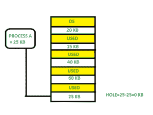

# 内存管理中的分区分配方法

> 原文:[https://www . geesforgeks . org/partition-allocation-methods-in-memory-management/](https://www.geeksforgeeks.org/partition-allocation-methods-in-memory-management/)

在操作系统中，以下是四种常见的内存管理技术。

**单连片分配:**MS-DOS 使用的最简单的分配方式。一个进程可以使用所有内存(除了为操作系统保留的内存)。

**分区分配:**内存被划分为不同的块或分区。每个流程都根据需求进行分配。

**分页内存管理:**内存被划分为固定大小的单元，称为页帧，用于虚拟内存环境。

**分段内存管理:**内存被分成不同的段(段是进程数据或代码的逻辑分组)。在这种管理中，分配的内存不必是连续的。

大多数操作系统(例如 Windows 和 Linux)都使用分页分段。一个流程被分成多个部分，每个部分都有页面。

在**分区分配**中，当有多个分区可以自由容纳进程的请求时，必须选择一个分区。要选择特定的分区，需要分区分配方法。如果分区分配方法避免了内部碎片，则认为它更好。

当需要将一个进程加载到主内存中时，如果有多个足够大的空闲内存块，那么操作系统将决定分配哪个空闲内存块。

有不同的放置算法:

A.第一次拟合

B.最佳配合

C.最不合身

D.下一次拟合

**1。第一次拟合**:在第一次拟合中，分配的分区是从主存顶部开始的第一个足够的块。它从头开始扫描内存，并选择第一个足够大的可用块。因此，它会分配足够大的第一个孔。

**2。最佳匹配**将进程分配给空闲可用分区中第一个最小的足够分区。它搜索整个孔列表，以找到尺寸大于或等于工艺尺寸的最小孔。

**3。最差匹配**将进程分配给主内存中可用的自由可用分区中最大的分区。它与最佳拟合算法相反。它搜索整个孔列表以找到最大的孔并将其分配给加工。

**4。下一次拟合:**下一次拟合类似于第一次拟合，但它将从最后一个分配点搜索第一个足够的分区。

**Best-Fit 真的是最好的吗？**
虽然最佳拟合最大限度地减少了空间浪费，但它会消耗大量处理器时间来搜索接近所需大小的块。此外，在某些情况下，最佳拟合的性能可能比其他算法差。例如，参见下面的练习。

**练习:**按照给定的顺序 300K、25K、125K 和 50K 考虑来自进程的请求。假设有两个大小为 150K 的可用内存块，后跟一个大小为 350K 的块。

以下哪些分区分配方案可以满足上述请求？
A)最适合，但不是第一适合。
B)第一适合但不是最佳适合。
C)两者第一契合&最佳契合。
D)既不是第一适合也不是最佳适合。

解决方案:让我们尝试所有选项。
最佳匹配:
从大小为 350K 的块中分配 300K。街区还剩 50 个。
剩余 50K 区块分配 25K。街区还剩 25K。
125K 从 150 K 块中分配。这个街区还剩下 25K。
即使有 25K + 25K 的可用空间，也无法分配 50K。

第一次拟合:
300K 请求从 350K 块中分配，50K 被遗漏。
25K 从 150K 块中分配，125K 遗漏。
然后将 125K 和 50K 分配给剩余的遗漏分区。
所以，第一个 fit 可以处理请求。

所以选项 B 是正确的选择。