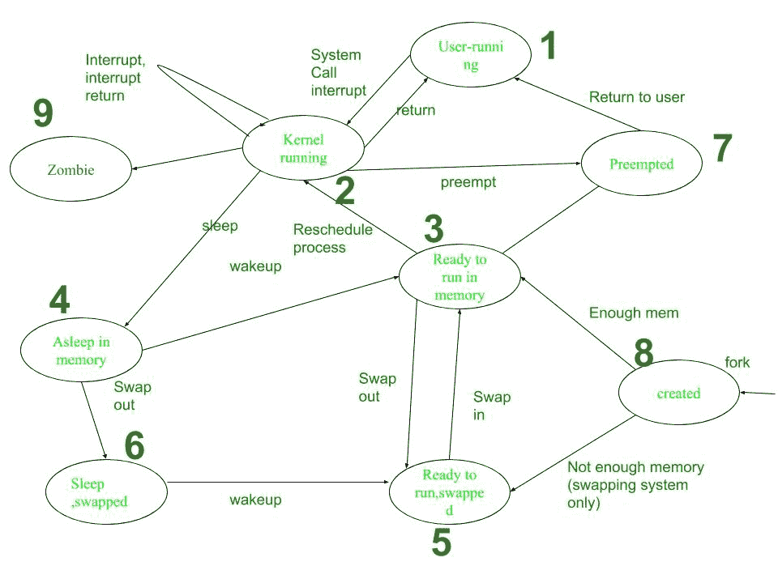

# UNIX 进程中的进程状态和转换

> 原文:[https://www . geesforgeks . org/process-States-and-transitions-in-a-UNIX-process/](https://www.geeksforgeeks.org/process-states-and-transitions-in-a-unix-process/)

### 过程

进程是正在执行的程序的一个实例。一组过程结合在一起就构成了一个完整的程序。

Unix 中有两类进程，即

*   **用户进程**:在用户模式下运行。
*   **内核进程**:在内核模式下运行。

### 进程状态

流程从开始到结束工作时进入的状态称为流程状态。这些内容如下:

*   **已创建**-进程是通过系统调用新创建的，尚未准备好运行
*   **用户运行**-进程以用户模式运行，这意味着它是一个用户进程。
*   **内核运行**-表示进程是以内核模式运行的内核进程。
*   **僵尸-** 进程不存在/终止。
*   **抢占-** 当进程从内核模式运行到用户模式时，称其被抢占。
*   **准备在内存中运行-** 表示进程已经到了准备在内存中运行的状态，正在等待内核调度。
*   **准备运行，已交换**–进程准备运行，但没有空的主内存
*   **休眠，已交换-** 进程已交换到二级存储，处于阻塞状态。
*   **在内存中休眠-** 进程在内存中(未交换到二级存储)，但处于阻塞状态。

数字表示要遵循的步骤。

### 流程转换

过程的工作按照以下步骤进行解释:

1.  **用户运行:**进程处于用户运行状态。
2.  **内核运行:**进程被分配给内核，因此处于内核模式。
3.  **准备在内存中运行:**此外，在主内存中处理后，进程被重新调度到内核，即进程没有执行，但是一旦内核调度它，它就准备运行。
4.  **在内存中休眠:**进程正在休眠，但驻留在主内存中。它正在等待任务开始。
5.  **准备运行，已交换:**进程准备运行，被处理器交换到主内存，从而允许内核调度它执行。
6.  **休眠，已交换:**进程在二级内存中处于休眠状态，为其他进程在主内存中的执行腾出空间。一旦任务完成，它可能会恢复。
7.  **先占:**内核先占一个正在进行的进程来分配另一个进程，而第一个进程正在从内核模式转移到用户模式。
8.  **已创建:**进程是新创建的，但未运行。这是所有进程的开始状态。
9.  **僵尸:**进程已彻底执行，退出调用已启用。
    因此，这个过程不再存在。但是，它存储了该过程的统计记录。
    这是所有流程的最终状态。