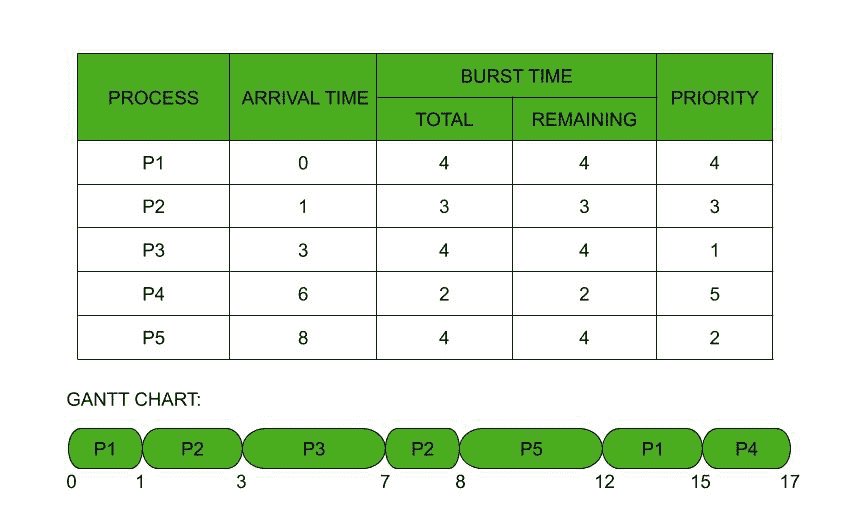
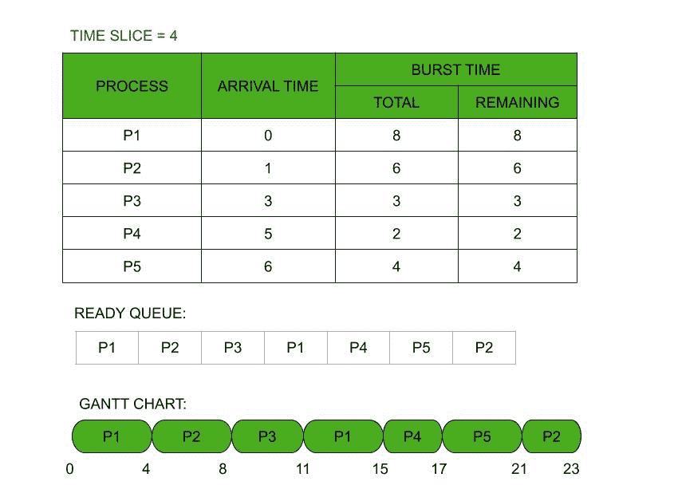

# 抢占优先级与循环调度算法的关系

> 原文:[https://www . geesforgeks . org/先占优先和循环调度算法之间的关系/](https://www.geeksforgeeks.org/relation-between-preemptive-priority-and-round-robin-scheduling-algorithm/)

在本文中，我们将尝试建立循环调度和[优先](https://www.geeksforgeeks.org/program-for-preemptive-priority-cpu-scheduling/)调度算法之间的关系。让我们先一个一个地讨论这些算法，然后建立循环是如何成为一种特殊的抢占式优先级调度算法的。

先决条件–[CPU 调度](https://www.geeksforgeeks.org/cpu-scheduling-in-operating-systems/) | [优先级和循环调度的区别。](https://www.geeksforgeeks.org/difference-between-priority-scheduling-and-round-robin-rr-cpu-scheduling/?ref=rp)

**[抢占式优先级调度算法](https://www.geeksforgeeks.org/difference-between-preemptive-priority-based-and-non-preemptive-priority-based-cpu-scheduling-algorithms/) :**

时间= 0 时的抢占式优先级调度算法

随着更高优先级的进程不断增加，先前的进程会被抢占，并在稍后获得 CPU。

**[循环调度算法](https://www.geeksforgeeks.org/program-round-robin-scheduling-set-1/) :**

循环调度算法是一种抢占式调度算法。它使用时间片或时间量子的概念。就绪队列开头的进程有机会首先被执行，但只能在一个时间段内执行。

随着越来越多的新进程被添加到就绪队列中，正在进行的进程被抢占并被添加到就绪队列的末尾。下一个过程有机会，同样是在一次性量子的跨度内。该算法是为分时系统设计的。

时间片= 4、时间= 0 的循环调度算法

**[循环调度算法](https://www.geeksforgeeks.org/round-robin-scheduling-with-different-arrival-times/)是一种特殊的[抢占式优先级调度算法](https://www.geeksforgeeks.org/difference-between-preemptive-priority-based-and-non-preemptive-priority-based-cpu-scheduling-algorithms/) :**

在循环调度算法中，当一个进程已经在中央处理器中被执行时，它有一个有限的时间量来执行，但是如果它不能完成自己，那么它就会被抢占。因此，随着时间量的增加，进程被抢占的机会也在增加。

它的优先级降低。然而，在就绪队列中等待的进程获得下一个中央处理器的机会正在增加。所以，它的优先级增加了。因此，我们可以说循环调度是一种特殊的抢占式优先级调度算法，其中就绪队列中的进程的优先级增加，而中央处理器中的进程的优先级降低。

**注意–**
另一方面，抢占优先级[调度算法](https://www.geeksforgeeks.org/cpu-scheduling-in-operating-systems/)在任何情况下的表现都不像 RR 算法。