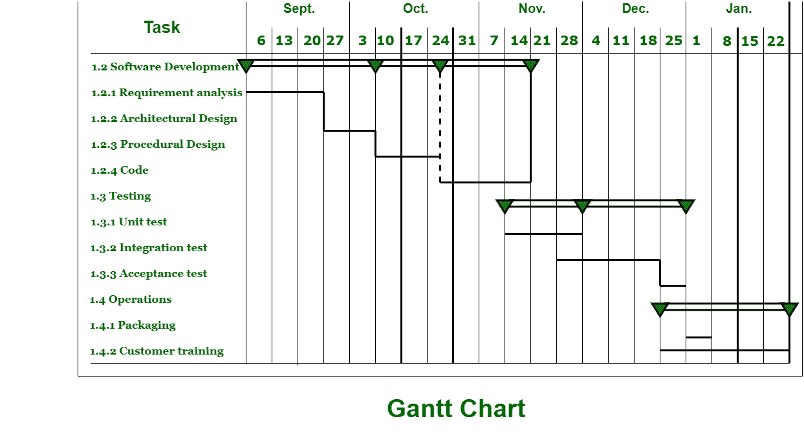

# 甘特图上的简短注释

> 原文:[https://www.geeksforgeeks.org/short-note-on-gantt-chart/](https://www.geeksforgeeks.org/short-note-on-gantt-chart/)

**通用活动标准化时间表(甘特图)**是一种图表类型，其中有一系列水平线，显示在给定时间内完成的工作量或生产量与这些项目的计划量的关系。它是亨利·甘特(美国工程师和社会科学家)于 1917 年作为生产控制工具开发的横条图。它只是用于进度的图形表示，有助于以有效的方式计划、协调和跟踪项目中的某些特定任务。

甘特图的目的是强调单个任务的范围。因此，一组任务被作为甘特图的输入。甘特图也称为时间线图。它可以为整个项目开发，也可以为单个功能开发。在大多数项目中，在生成时间表之后，会准备项目表。在项目表中，所有任务都以适当的方式列出，包括开始日期和结束日期以及与之相关的信息。

**甘特图代表以下事物:**

*   所有任务都列在最左边一列。
*   水平条指示或表示相应特定任务所需的时间。
*   当多个横条同时出现在日历上时，这意味着并发可以应用于执行特定的任务。
*   钻石代表里程碑。

**优势:**T2】

*   **简单分析项目–**
    甘特图通常用于简化复杂的项目。

*   **建立时间表–**
    它只是建立初始项目时间表，其中提到谁将做什么，什么时候做，以及完成它需要多长时间。

*   **提供效率–**
    它带来规划效率，让团队更好地协调项目活动。

*   **强调范围–**
    它有助于强调，即重视个人任务的范围。

*   **易于理解–**
    它使利益相关者易于理解时间表，并带来日期的清晰性。

*   **可视化项目–**
    它有助于清晰地可视化项目管理、所涉及的项目任务。

*   **整理思路并高度可见–**
    它整理你的思路并可以高度可见，这样企业中的每个人即使没有参与工作，也可以对项目中发生的事情有基本的了解和知识。

*   **制定切实可行的规划–**
    它使项目规划切实可行，因为切实可行的规划通常有助于避免任何可能出现的延误和损失。

**劣势:**T2】

*   有时，使用甘特图会使项目变得更加复杂。
*   条形图的大小不一定表示项目中完成的工作量。
*   甘特图和项目需要定期更新。
*   在一张纸上查看此图表是不可能的，也是困难的。制作甘特图的软件产品需要在计算机屏幕上查看，这样整个项目就可以很容易地看到。

**应用:**
有几个职业，使用甘特图非常有益。其中一些如下:

*   **广告经理–**
    广告经理一般控制和监督广告公司的最终结果，调度不同媒体的广告等。

*   **运营经理–**
    运营经理通常控制和处理对公司运营至关重要的资源。

*   **项目经理–**
    项目经理通常会激励项目团队，与团队成员合作，安排任务并按时完成，并向利益相关方报告等。

**示例:**
如今，有很多公司和团队使用甘特图来计划、安排和执行他们的项目。其中一些是咨询机构、制造公司、营销团队、建筑公司等。下面是甘特图的示例:

