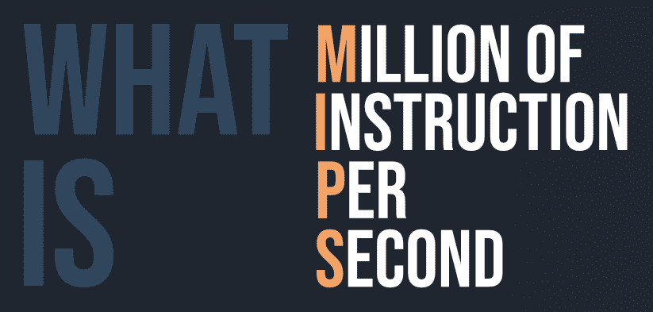

# 什么是 MIPS(每秒百万条指令)？

> 原文:[https://www . geesforgeks . org/what-is-mipsmillion of-instructions-per-second/](https://www.geeksforgeeks.org/what-is-mipsmillion-of-instructions-per-second/)

这可能是一种测量计算机处理器原始速度的策略。由于 MIPS 估计没有考虑其他因素，如计算机的输入/输出速度或处理器工程，因此它不是一种持续评估计算机执行程度的合理方法。对于这种情况，以 100 兆比特/秒评估的计算机可能比以 120 兆比特/秒评估的另一台计算机更快地计算某些容量。

像国际商用机器公司这样的计算机制造商已经使用了最大利益点估算来衡量“计算成本”电脑的价值是以每美元的 MIPS 来决定的。利益，在最后的几十年里，每美元对计算机的尊重在每年的前提下不断增加。

#### 如何计算分子印迹聚合物

计算 MIPS 所需的输入是处理器每秒的指令数、中央处理器处理器速度(每秒周期数)、中央处理器接口(每条指令的平均时钟周期数)和执行时间。

**方法 1:**
如果给出了指令数量和执行时间。

**步骤 1:** 在指令数量和执行时间之间执行除法运算，并将该值存储在变量中。

**第 2 步:**在该变量和 100 万之间执行除法运算，以获得每秒数百万条指令。

**示例:**

> 如果一台计算机在 0.10 秒内完成 200 万条指令
> 
> 200 万/10 万= 2000 万。
> 
> MISP 数量= 2000 万/100 万
> 
> =20

**方法 2:**
如果给定每秒的周期数(CPU)和每条指令的周期数(CPI)。

**步骤 1:** 在每秒周期数(CPU)和每条指令周期数(CPI)之间执行除法运算，并将该值存储在变量中。

**第 2 步:**在该变量和 100 万之间执行除法运算，以获得每秒数百万条指令。

**示例:**

> 如果一台中央处理器为 400 兆赫的计算机的消费物价指数为 2
> 
> 400/2=200
> 
> MISP 数= 200/100 万
> 0.0002

#### 分子印迹聚合物的优点

*   很容易理解和衡量
*   它有助于计算中央处理器处理器速度(每秒周期数)、中央处理器接口(每条指令的平均时钟周期数)和执行时间。
*   它处理工作量大的情况。

#### 分子印迹聚合物的缺点

*   它可能不能反映真正的执行，因为简单的指令做得更好。
*   这是一种旧的过时的计算机速度和功率测量方法